# FES Stories - Architecture Diagrams

This document contains Mermaid diagrams illustrating the complete authentication and API request flows for both the current implementation (without BFF) and the recommended BFF pattern.

## Table of Contents

1. [Current Architecture (Without BFF)](#current-architecture-without-bff)
2. [BFF Architecture (Recommended)](#bff-architecture-recommended)
3. [Comparison](#comparison)

---

## Current Architecture (Without BFF)

### Complete User Login Flow

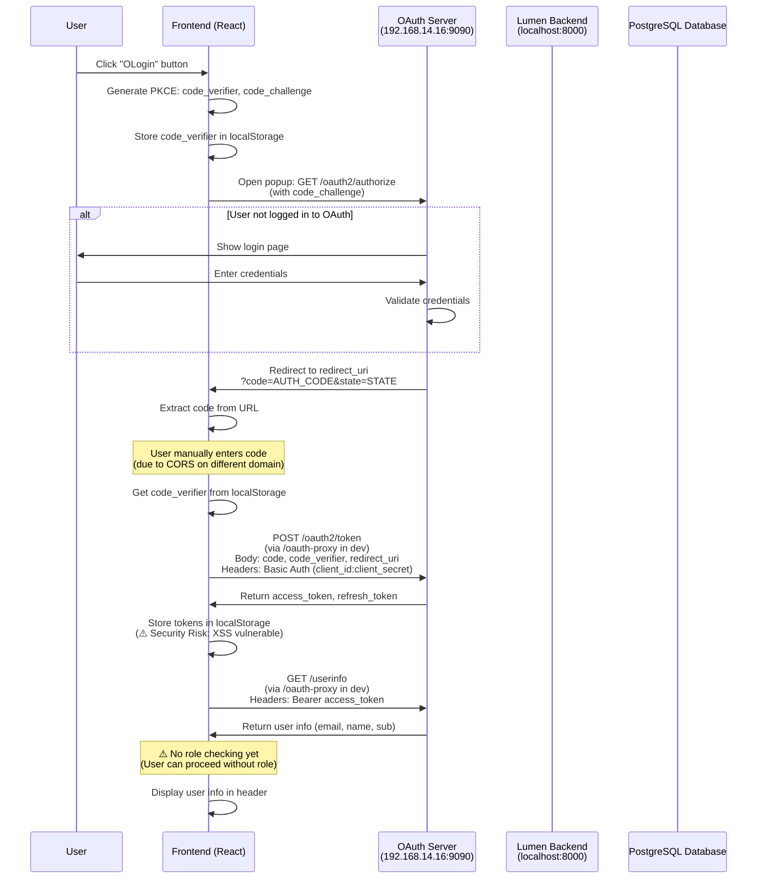

### API Request Flow (Current)

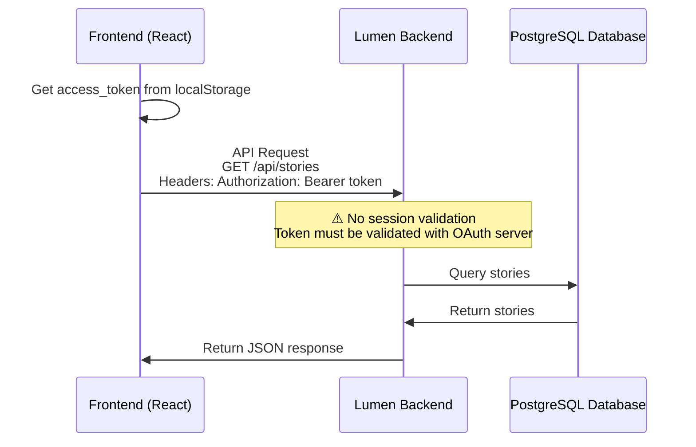

### Security Issues (Current)

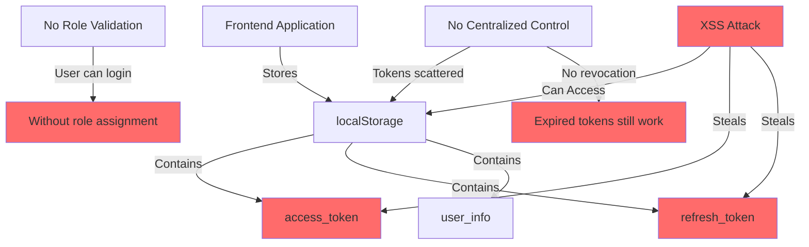

---

## BFF Architecture (Recommended)

### Complete User Login Flow (BFF)

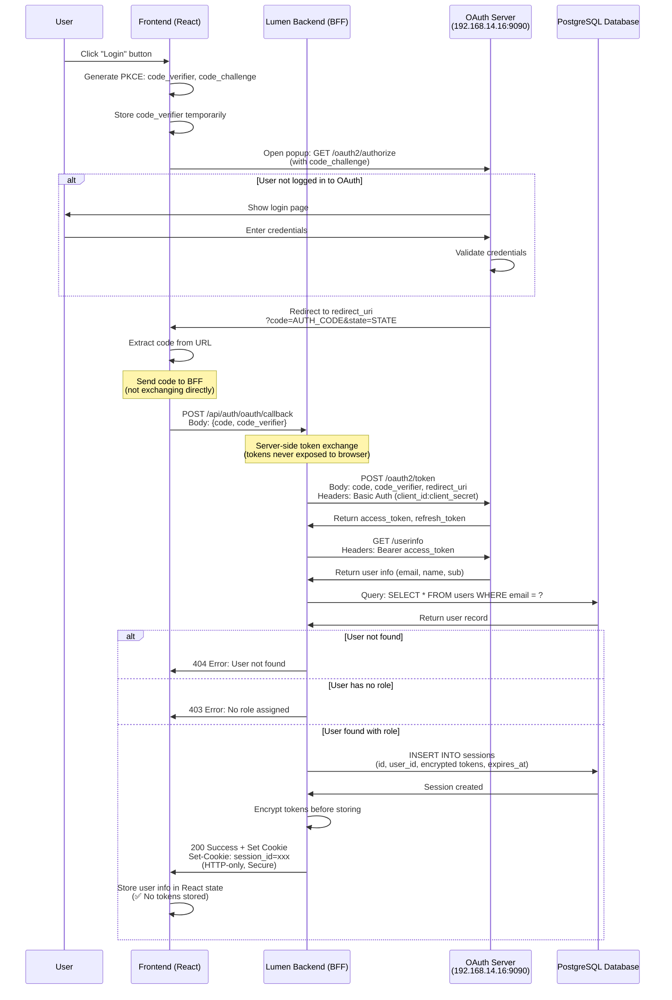

### API Request Flow (BFF)

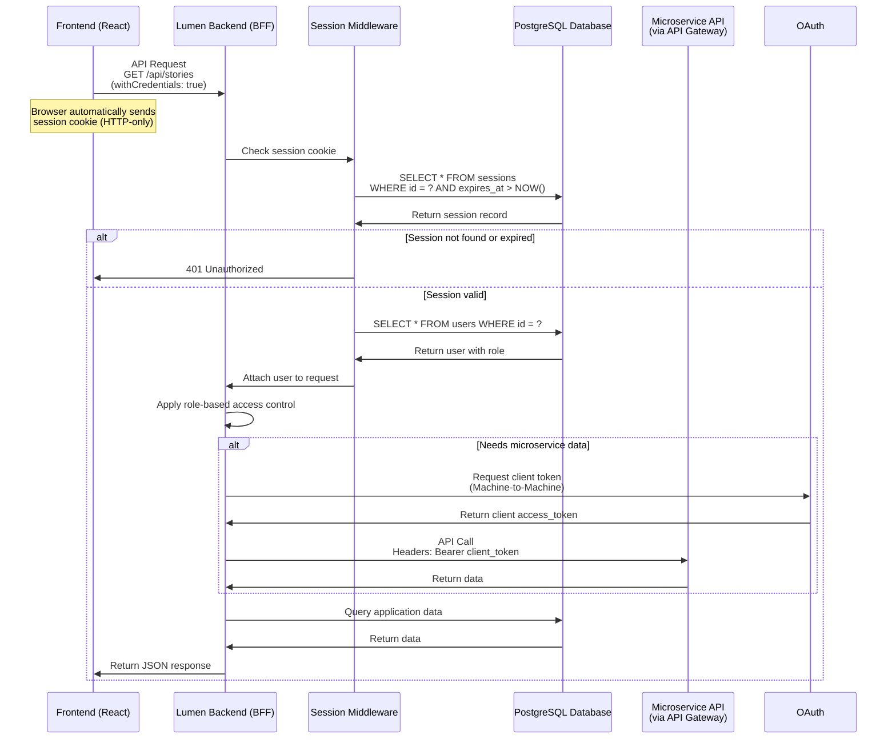

### Machine-to-Machine Flow (Microservice Access)

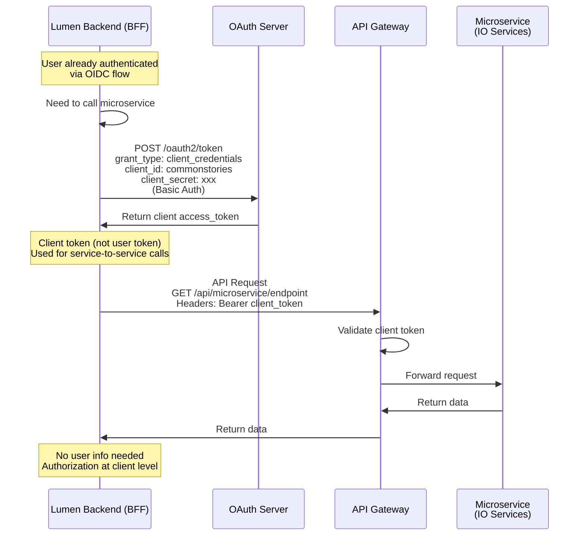

### Complete System Architecture (BFF)

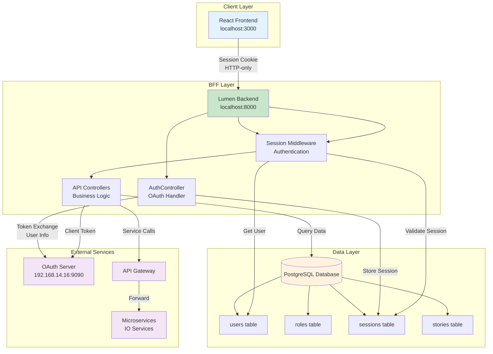

### Security Flow Comparison

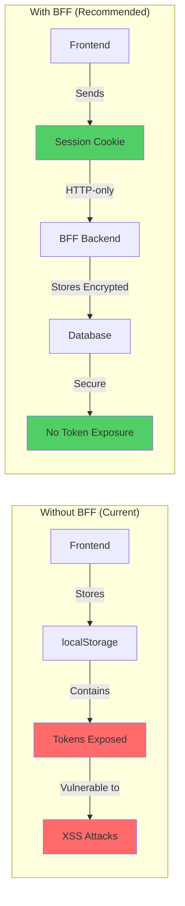

### Token Storage Comparison

```mermaid
graph TD
    subgraph "Current: Frontend-Direct"
        A[Browser localStorage] -->|Stores| B[access_token<br/>refresh_token<br/>user_info]
        B -->|Visible to| C[JavaScript]
        C -->|Vulnerable to| D[XSS Attacks]
    end
    
    subgraph "BFF: Server-Side"
        E[HTTP-only Cookie] -->|Contains| F[session_id]
        F -->|Sent to| G[BFF Backend]
        G -->|Queries| H[Database]
        H -->|Stores Encrypted| I[oauth_access_token<br/>oauth_refresh_token]
        I -->|Never Exposed| J[Browser]
    end
    
    style B fill:#ff6b6b
    style D fill:#ff6b6b
    style F fill:#51cf66
    style I fill:#51cf66
    style J fill:#51cf66
```

### Role-Based Access Control Flow

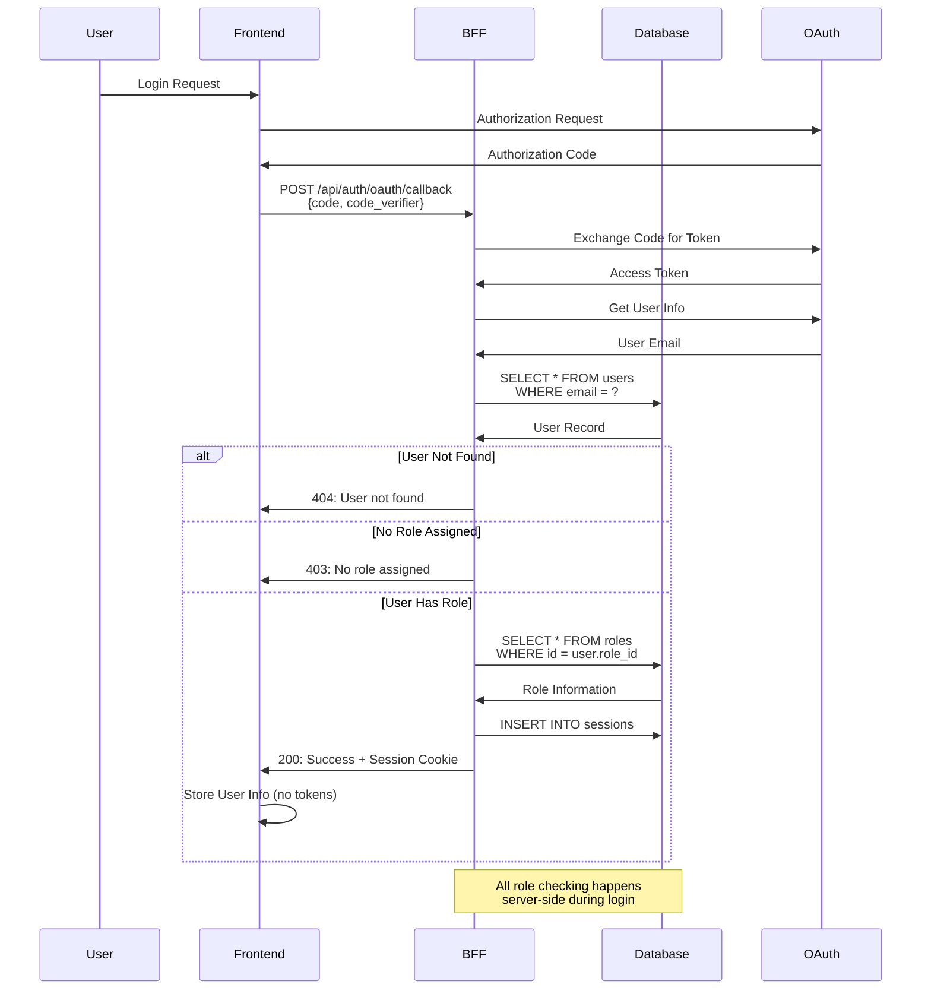

### Session Management Flow

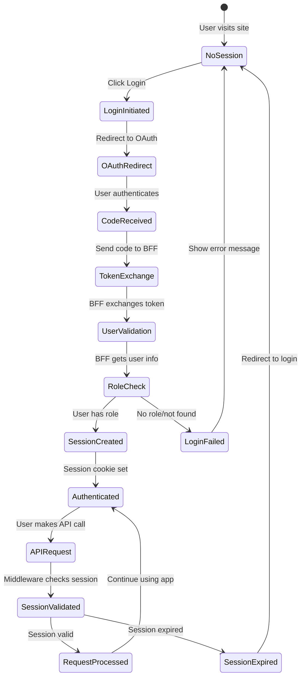

### Data Flow: Story Submission Example

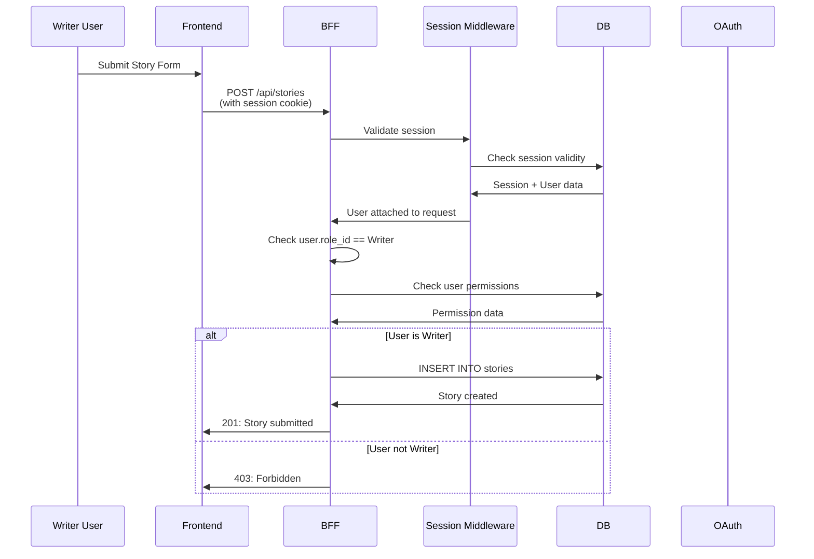

### Microservice Integration Flow

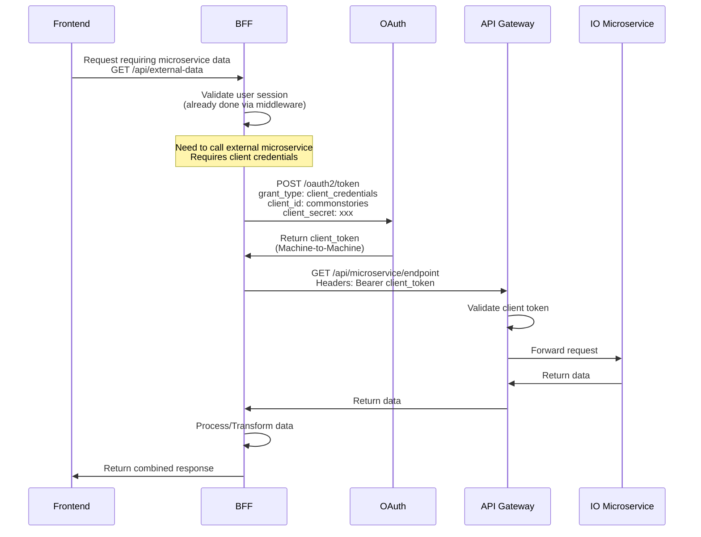

---

## Comparison

### Architecture Comparison Table

| Aspect | Without BFF (Current) | With BFF (Recommended) |
|--------|----------------------|------------------------|
| **Token Storage** | localStorage (browser) | Database (server, encrypted) |
| **Token Exposure** | ✅ Exposed to JavaScript | ❌ Never exposed |
| **XSS Protection** | ❌ Vulnerable | ✅ HTTP-only cookies |
| **Session Management** | Manual (localStorage) | Automatic (database) |
| **Role Validation** | ❌ Not implemented | ✅ Server-side validation |
| **Token Revocation** | ❌ Not possible | ✅ Can revoke sessions |
| **Microservice Integration** | ❌ Difficult | ✅ Easy (client tokens) |
| **Centralized Control** | ❌ No | ✅ Yes |
| **Security** | ⚠️ Medium | ✅ High |

### Request Flow Comparison

#### Without BFF:
```
User → Frontend → OAuth Server → Frontend (tokens) → Frontend (localStorage) → API Calls (with token)
```

#### With BFF:
```
User → Frontend → OAuth Server → Frontend (code) → BFF (tokens) → BFF (session) → Frontend (cookie) → API Calls (with cookie)
```

### Security Comparison

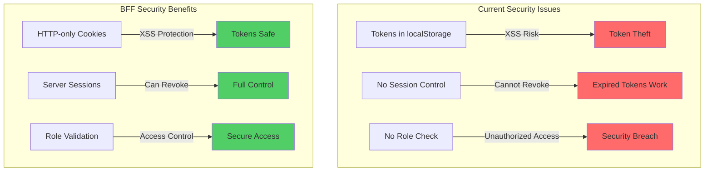

---

## Key Takeaways

### Without BFF (Current):
- ⚠️ Tokens stored in browser (security risk)
- ⚠️ No centralized session management
- ⚠️ No role validation during login
- ⚠️ Difficult to integrate with microservices

### With BFF (Recommended):
- ✅ Tokens stored server-side (encrypted)
- ✅ HTTP-only cookies (XSS protection)
- ✅ Centralized session management
- ✅ Role validation during login
- ✅ Easy microservice integration
- ✅ Better security posture

---

## Implementation Priority

1. **Phase 1**: Add sessions table to database
2. **Phase 2**: Implement OAuth callback endpoint in BFF
3. **Phase 3**: Create session middleware
4. **Phase 4**: Update frontend to use BFF endpoints
5. **Phase 5**: Remove token storage from localStorage
6. **Phase 6**: Implement microservice client token flow

---

**Note**: All diagrams use Mermaid syntax and can be rendered in:
- GitHub/GitLab markdown
- VS Code with Mermaid extension
- Online Mermaid editors (mermaid.live)
- Documentation tools that support Mermaid

