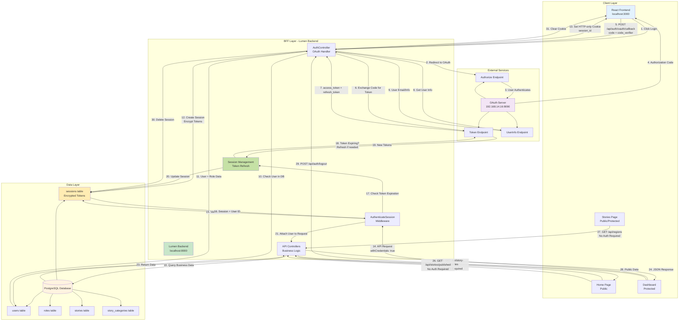

# FES Stories - Current Architecture & Flow

This document illustrates the complete current architecture and flow of the FES Stories application using the Backend-for-Frontend (BFF) pattern.

## Complete System Architecture & Flow

## Key Components

### 1. **Authentication Flow (Steps 1-13)**
- User initiates OAuth login via PKCE flow
- Frontend receives authorization code
- Code sent to BFF backend (never exposed to browser)
- BFF exchanges code for tokens server-side
- Tokens encrypted and stored in database
- HTTP-only session cookie set in browser

### 2. **Session Management (Steps 14-24)**
- All API requests include session cookie automatically
- Middleware validates session on each request
- Automatic token refresh when expiring (within 5 minutes)
- User attached to request for authorization checks
- Business logic executes with user context

### 3. **Public Routes (Steps 25-28)**
- Categories, published stories, and regions accessible without authentication
- No session validation required
- Data filtered to show only active/public content

### 4. **Security Features**
- ✅ Tokens stored server-side (encrypted in database)
- ✅ HTTP-only cookies (XSS protection)
- ✅ Automatic token refresh (seamless user experience)
- ✅ Role-based access control (server-side validation)
- ✅ Session revocation capability

## Technology Stack

- **Frontend**: React (Vite)
- **Backend**: Lumen (PHP)
- **Database**: PostgreSQL
- **Authentication**: OAuth 2.0 with PKCE
- **Session Storage**: Database (encrypted)
- **Token Management**: Server-side with automatic refresh

