# FES Stories Database Schema Documentation

## Table of Contents

1. [users](#1-users)
2. [roles](#2-roles)
3. [permissions](#3-permissions)
4. [role_permissions](#4-role_permissions)
5. [regions](#5-regions)
6. [organizations](#6-organizations)
7. [story_categories](#7-story_categories)
8. [stories](#8-stories)
9. [sessions](#9-sessions)
10. [activities](#10-activities)
11. [category_regions](#11-category_regions)
12. [category_organizations](#12-category_organizations)
13. [migrations](#13-migrations)

---

## 1. users

### Schema

| Column Name | Data Type | Constraints | Description |
|------------|-----------|-------------|-------------|
| `id` | BIGSERIAL | PRIMARY KEY | Auto-incrementing user ID |
| `name` | VARCHAR | NOT NULL | User's full name |
| `email` | VARCHAR | UNIQUE, NOT NULL | User's email address |
| `role_id` | BIGINT | FOREIGN KEY → `roles.id` | User's role |
| `organization_id` | BIGINT | FOREIGN KEY → `organizations.id`, NULLABLE | Organization the user belongs to |
| `region_id` | BIGINT | FOREIGN KEY → `regions.id`, NULLABLE | Region/State the user is associated with |
| `is_active` | BOOLEAN | DEFAULT true | Whether the user account is active |
| `created_at` | TIMESTAMP | | Account creation timestamp |
| `updated_at` | TIMESTAMP | | Last update timestamp |

### Mermaid Diagram

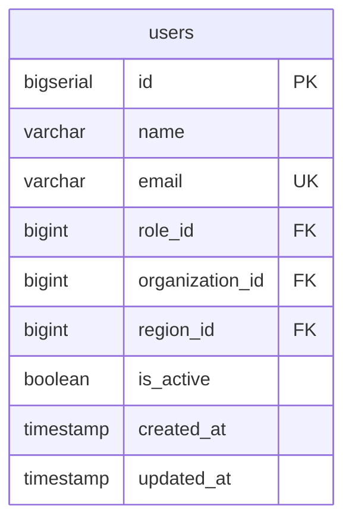

---

## 2. roles

### Schema

| Column Name | Data Type | Constraints | Description |
|------------|-----------|-------------|-------------|
| `id` | BIGSERIAL | PRIMARY KEY | Auto-incrementing role ID |
| `role_name` | VARCHAR | UNIQUE, NOT NULL | Role name (e.g., "Writer", "Editor", "Super Admin") |
| `created_at` | TIMESTAMP | | Role creation timestamp |
| `updated_at` | TIMESTAMP | | Last update timestamp |

### Mermaid Diagram

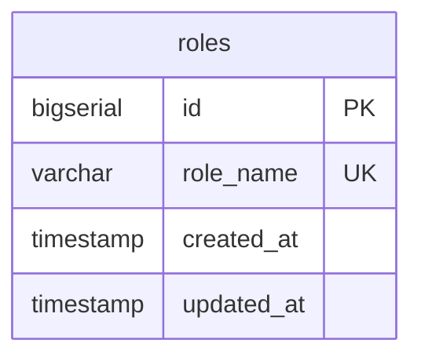

---

## 3. permissions

### Schema

| Column Name | Data Type | Constraints | Description |
|------------|-----------|-------------|-------------|
| `id` | BIGSERIAL | PRIMARY KEY | Auto-incrementing permission ID |
| `name` | VARCHAR | NOT NULL | Permission display name |
| `slug` | VARCHAR | UNIQUE, NOT NULL | Permission identifier |
| `description` | TEXT | NULLABLE | Permission description |
| `created_at` | TIMESTAMP | | Permission creation timestamp |
| `updated_at` | TIMESTAMP | | Last update timestamp |

### Mermaid Diagram

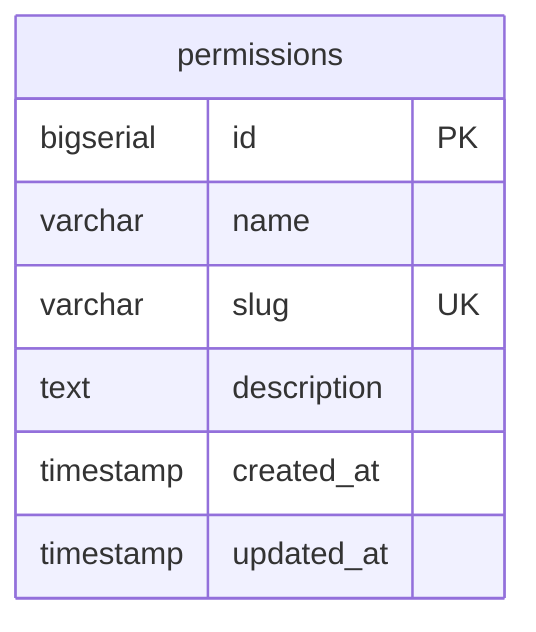

---

## 4. role_permissions

### Schema

| Column Name | Data Type | Constraints | Description |
|------------|-----------|-------------|-------------|
| `id` | BIGSERIAL | PRIMARY KEY | Auto-incrementing ID |
| `role_id` | BIGINT | FOREIGN KEY → `roles.id` | Role ID |
| `permission_id` | BIGINT | FOREIGN KEY → `permissions.id` | Permission ID |
| `created_at` | TIMESTAMP | | Relationship creation timestamp |
| `updated_at` | TIMESTAMP | | Last update timestamp |

### Mermaid Diagram

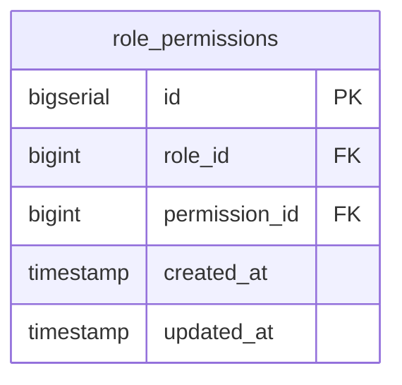

---

## 5. regions

### Schema

| Column Name | Data Type | Constraints | Description |
|------------|-----------|-------------|-------------|
| `id` | BIGSERIAL | PRIMARY KEY | Auto-incrementing region ID |
| `name` | VARCHAR(100) | UNIQUE, NOT NULL | State/Region name |
| `code` | VARCHAR(10) | UNIQUE, NULLABLE | State code (e.g., "MH", "KA") |
| `is_active` | BOOLEAN | DEFAULT true | Whether the region is active |
| `created_at` | TIMESTAMP | | Region creation timestamp |
| `updated_at` | TIMESTAMP | | Last update timestamp |

### Mermaid Diagram

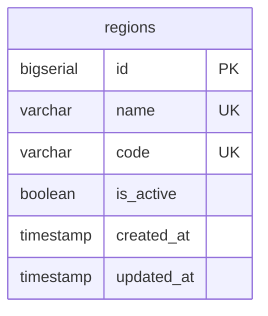

---

## 6. organizations

### Schema

| Column Name | Data Type | Constraints | Description |
|------------|-----------|-------------|-------------|
| `id` | BIGSERIAL | PRIMARY KEY | Auto-incrementing organization ID |
| `name` | VARCHAR(255) | NOT NULL | Organization name |
| `region_id` | BIGINT | FOREIGN KEY → `regions.id` | Region/State where organization is located |
| `is_active` | BOOLEAN | DEFAULT true | Whether the organization is active |
| `created_at` | TIMESTAMP | | Organization creation timestamp |
| `updated_at` | TIMESTAMP | | Last update timestamp |

### Mermaid Diagram

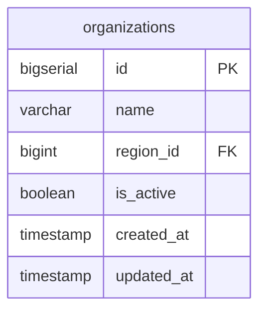

---

## 7. story_categories

### Schema

| Column Name | Data Type | Constraints | Description |
|------------|-----------|-------------|-------------|
| `id` | BIGSERIAL | PRIMARY KEY | Auto-incrementing category ID |
| `name` | VARCHAR | NOT NULL | Category name |
| `description` | TEXT | NULLABLE | Category description |
| `is_active` | BOOLEAN | DEFAULT true | Whether the category is active |
| `created_at` | TIMESTAMP | | Category creation timestamp |
| `updated_at` | TIMESTAMP | | Last update timestamp |

### Mermaid Diagram

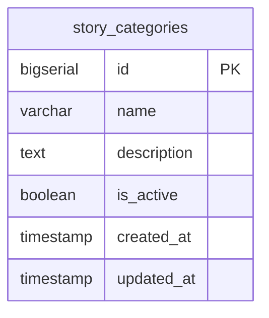

---

## 8. stories

### Schema

| Column Name | Data Type | Constraints | Description |
|------------|-----------|-------------|-------------|
| `id` | BIGSERIAL | PRIMARY KEY | Auto-incrementing story ID |
| `user_id` | BIGINT | FOREIGN KEY → `users.id`, NULLABLE | Author of the story |
| `category_id` | BIGINT | FOREIGN KEY → `story_categories.id`, NULLABLE | Story category |
| `title` | VARCHAR | NOT NULL | Story title |
| `slug` | VARCHAR | UNIQUE, NULLABLE | URL-friendly story identifier |
| `subtitle` | VARCHAR | NULLABLE | Story subtitle |
| `photo_url` | VARCHAR | NULLABLE | Photo URL for the person in the story |
| `quote` | TEXT | NULLABLE | Quote from the person |
| `person_name` | VARCHAR | NULLABLE | Name of the person in the story |
| `person_location` | VARCHAR | NULLABLE | Location of the person |
| `facilitator_name` | VARCHAR | NULLABLE | Facilitator's name |
| `facilitator_organization` | VARCHAR | NULLABLE | Facilitator's organization |
| `state_id` | VARCHAR | NULLABLE | State ID from Admin Hierarchy API |
| `state_name` | VARCHAR | NULLABLE | State name |
| `district_id` | VARCHAR | NULLABLE | District ID from Admin Hierarchy API |
| `district_name` | VARCHAR | NULLABLE | District name |
| `sub_district_id` | VARCHAR | NULLABLE | Sub-district ID |
| `sub_district_name` | VARCHAR | NULLABLE | Sub-district name |
| `block_id` | VARCHAR | NULLABLE | Block ID |
| `block_name` | VARCHAR | NULLABLE | Block name |
| `panchayat_id` | VARCHAR | NULLABLE | Panchayat ID |
| `panchayat_name` | VARCHAR | NULLABLE | Panchayat name |
| `village_id` | VARCHAR | NULLABLE | Village ID |
| `village_name` | VARCHAR | NULLABLE | Village name |
| `latitude` | DECIMAL(10, 8) | NULLABLE | Latitude coordinate for map display |
| `longitude` | DECIMAL(11, 8) | NULLABLE | Longitude coordinate for map display |
| `description` | TEXT | NULLABLE | Story description/summary |
| `content` | TEXT | NULLABLE | Full story content |
| `status` | VARCHAR | DEFAULT 'pending' | Story status: 'pending', 'approved', 'rejected', 'published' |
| `approved_by` | BIGINT | FOREIGN KEY → `users.id`, NULLABLE | User who approved the story |
| `approved_at` | TIMESTAMP | NULLABLE | Approval timestamp |
| `published_at` | TIMESTAMP | NULLABLE | Publication timestamp |
| `rejection_reason` | TEXT | NULLABLE | Reason for rejection (if rejected) |
| `created_at` | TIMESTAMP | | Story creation timestamp |
| `updated_at` | TIMESTAMP | | Last update timestamp |

### Mermaid Diagram

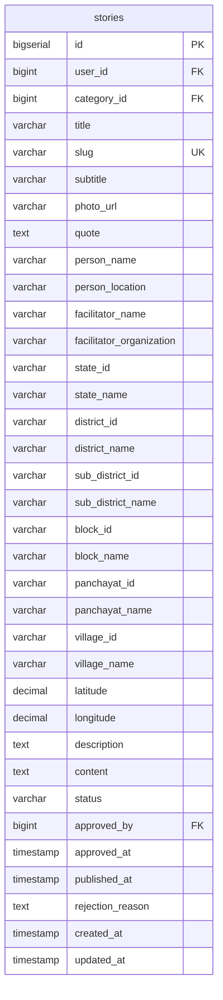

---

## 9. sessions

### Schema

| Column Name | Data Type | Constraints | Description |
|------------|-----------|-------------|-------------|
| `id` | VARCHAR(40) | PRIMARY KEY | Session ID (40-character string) |
| `user_id` | BIGINT | FOREIGN KEY → `users.id` | User associated with the session |
| `oauth_access_token` | TEXT | NOT NULL | Encrypted OAuth access token |
| `oauth_refresh_token` | TEXT | NULLABLE | Encrypted OAuth refresh token |
| `expires_at` | TIMESTAMP | NOT NULL | Access token expiration timestamp |
| `created_at` | TIMESTAMP | | Session creation timestamp |
| `updated_at` | TIMESTAMP | | Last update timestamp |

### Mermaid Diagram

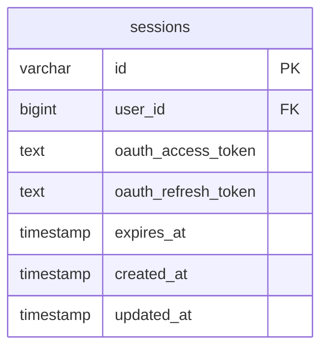

---

## 10. activities

### Schema

| Column Name | Data Type | Constraints | Description |
|------------|-----------|-------------|-------------|
| `id` | BIGSERIAL | PRIMARY KEY | Auto-incrementing activity ID |
| `user_id` | BIGINT | FOREIGN KEY → `users.id`, NULLABLE | User who performed the activity |
| `type` | VARCHAR(50) | NOT NULL | Activity type (e.g., "login", "create", "edit", "delete") |
| `message` | TEXT | NOT NULL | Human-readable activity message |
| `metadata` | JSONB | NULLABLE | Additional activity data in JSON format |
| `created_at` | TIMESTAMP | | Activity timestamp |

### Mermaid Diagram

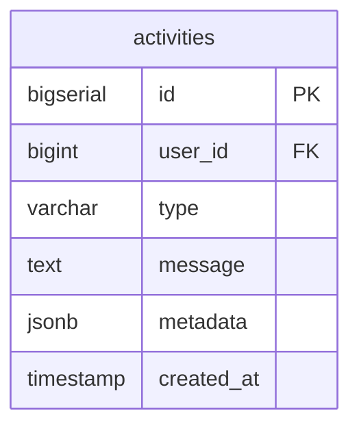

---

## 11. category_regions

### Schema

| Column Name | Data Type | Constraints | Description |
|------------|-----------|-------------|-------------|
| `id` | BIGSERIAL | PRIMARY KEY | Auto-incrementing ID |
| `category_id` | BIGINT | FOREIGN KEY → `story_categories.id` | Category ID |
| `region_id` | BIGINT | FOREIGN KEY → `regions.id` | Region ID |
| `created_at` | TIMESTAMP | | Relationship creation timestamp |
| `updated_at` | TIMESTAMP | | Last update timestamp |

### Mermaid Diagram

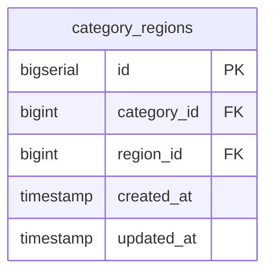

---

## 12. category_organizations

### Schema

| Column Name | Data Type | Constraints | Description |
|------------|-----------|-------------|-------------|
| `id` | BIGSERIAL | PRIMARY KEY | Auto-incrementing ID |
| `category_id` | BIGINT | FOREIGN KEY → `story_categories.id` | Category ID |
| `organization_id` | BIGINT | FOREIGN KEY → `organizations.id` | Organization ID |
| `created_at` | TIMESTAMP | | Relationship creation timestamp |
| `updated_at` | TIMESTAMP | | Last update timestamp |

### Mermaid Diagram

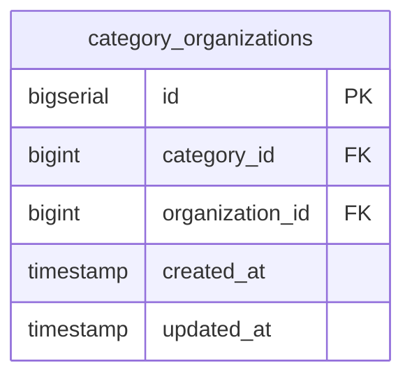

---

## 13. migrations

### Schema

| Column Name | Data Type | Constraints | Description |
|------------|-----------|-------------|-------------|
| `id` | BIGSERIAL | PRIMARY KEY | Auto-incrementing migration ID |
| `migration` | VARCHAR | NOT NULL | Migration file name |
| `batch` | INTEGER | NOT NULL | Migration batch number |

### Mermaid Diagram

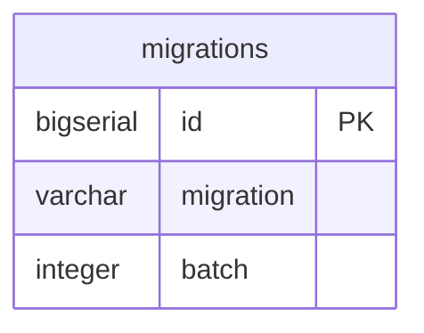

---

**Last Updated:** December 22, 2025
