# Refresh Token Flow - Complete System Overview

This document explains all refresh token scenarios in the FES Stories application using a hybrid approach (Frontend Proactive + Backend Reactive).

## System Architecture

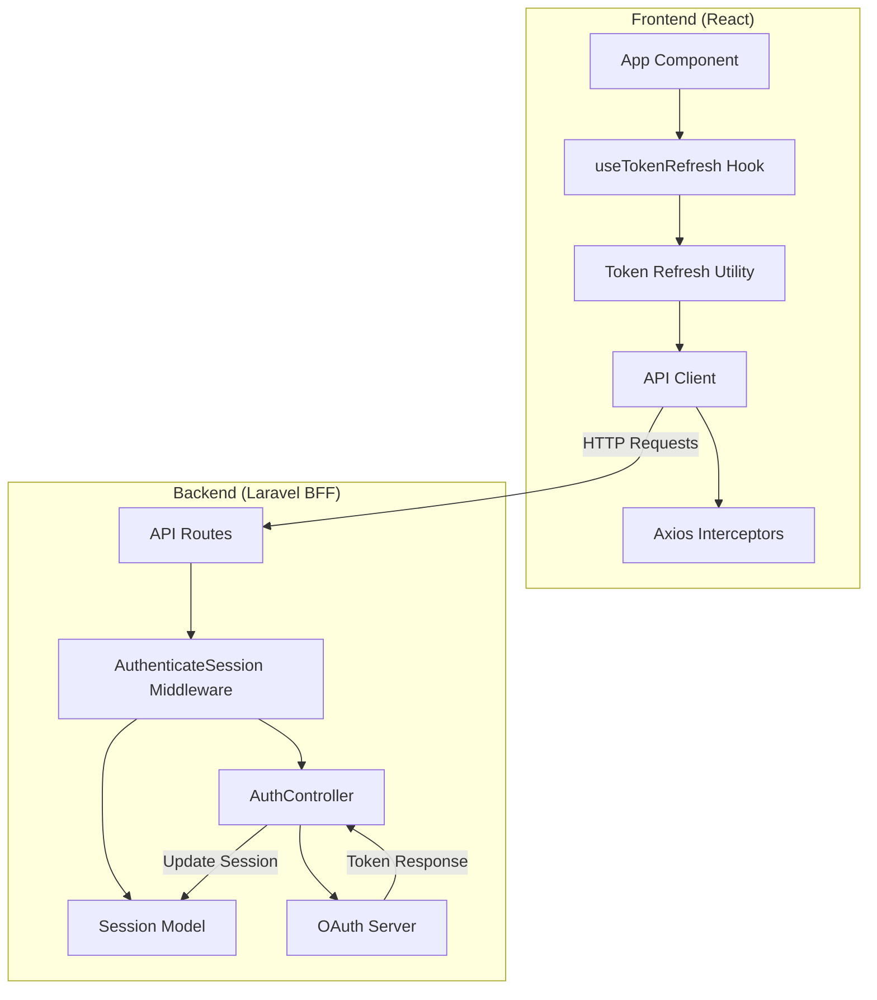

## Complete Refresh Token Scenarios

### Scenario 1: User Logs In (Initial Authentication)

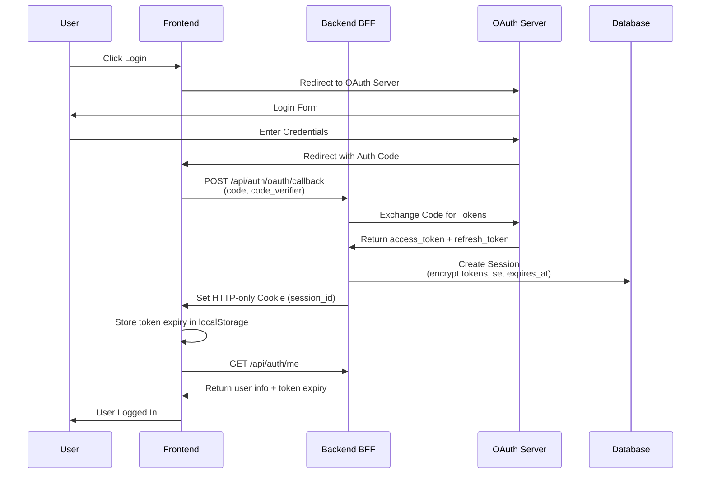

### Scenario 2: Token Expired, Refresh Token Valid (User Returns Next Day)

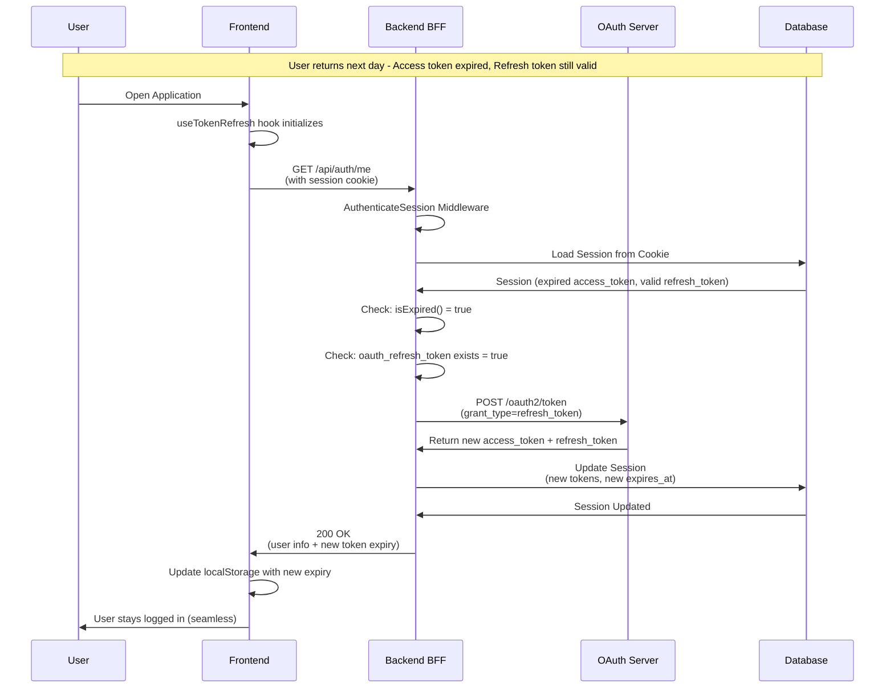

### Scenario 3: Token Expired, Refresh Token Also Expired

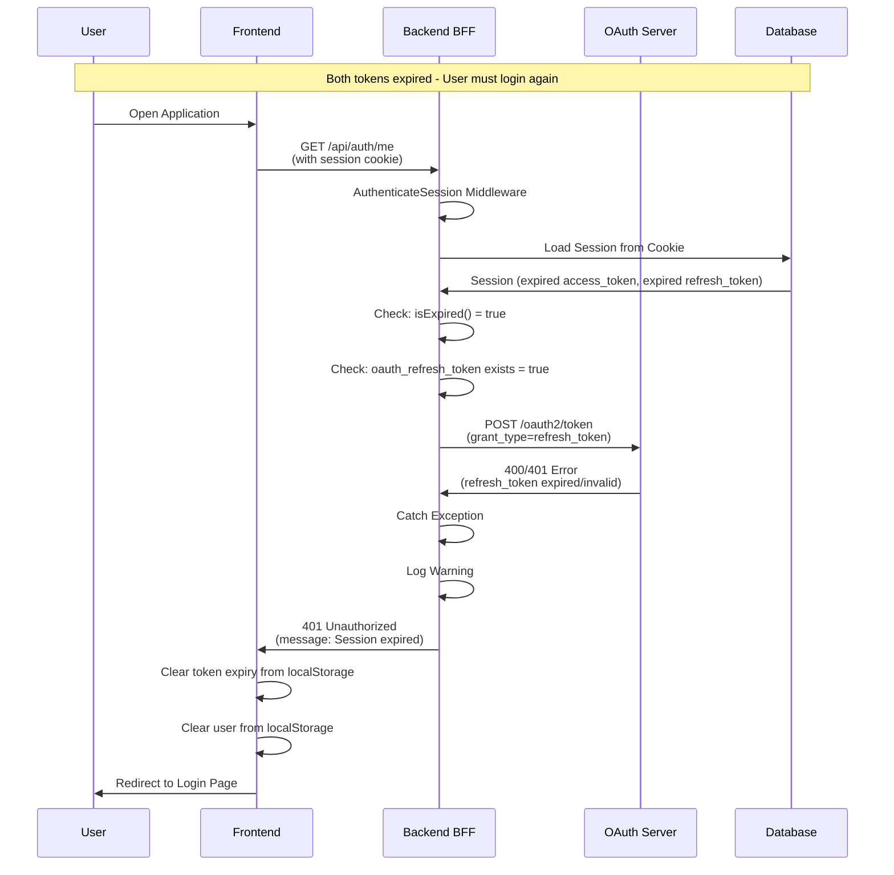

### Scenario 4: Proactive Token Refresh (Token Valid but Near Expiry)

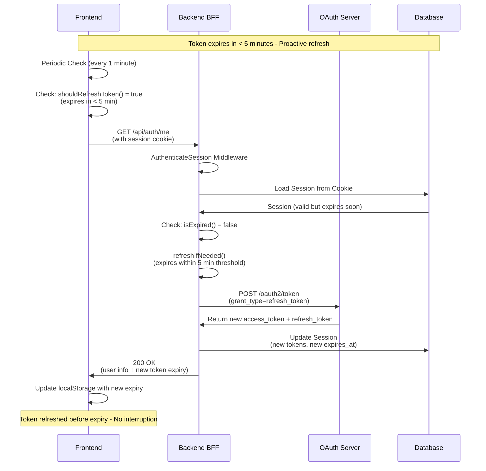

### Scenario 5: User Returns to Tab (Visibility API)

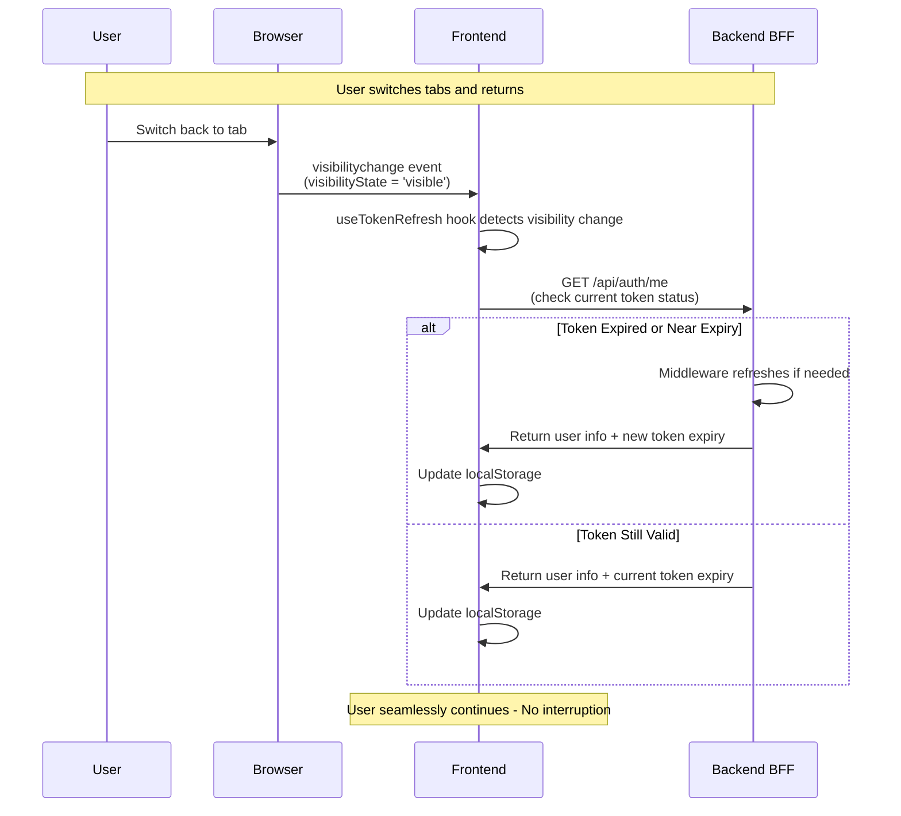

### Scenario 6: API Request with Expired Token (Reactive Refresh)

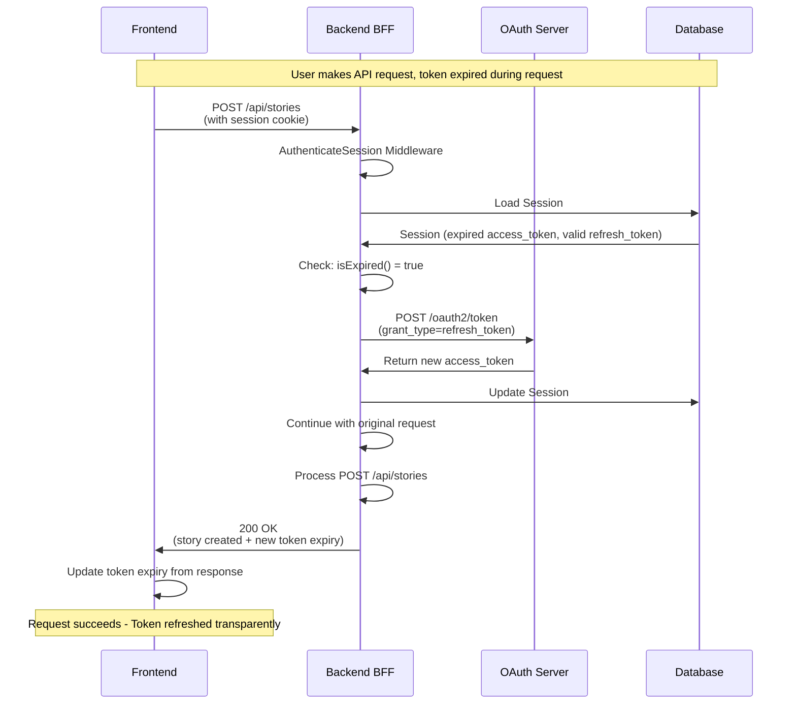

### Scenario 7: No Refresh Token Available

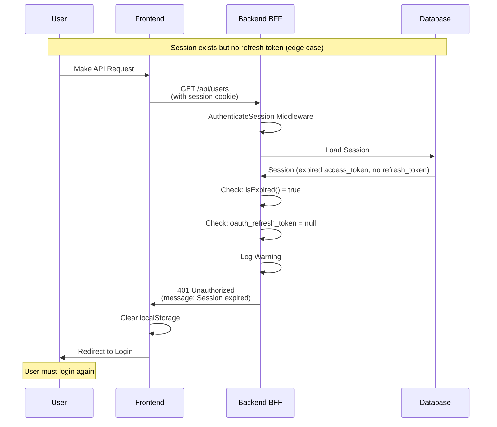

## Complete State Diagram

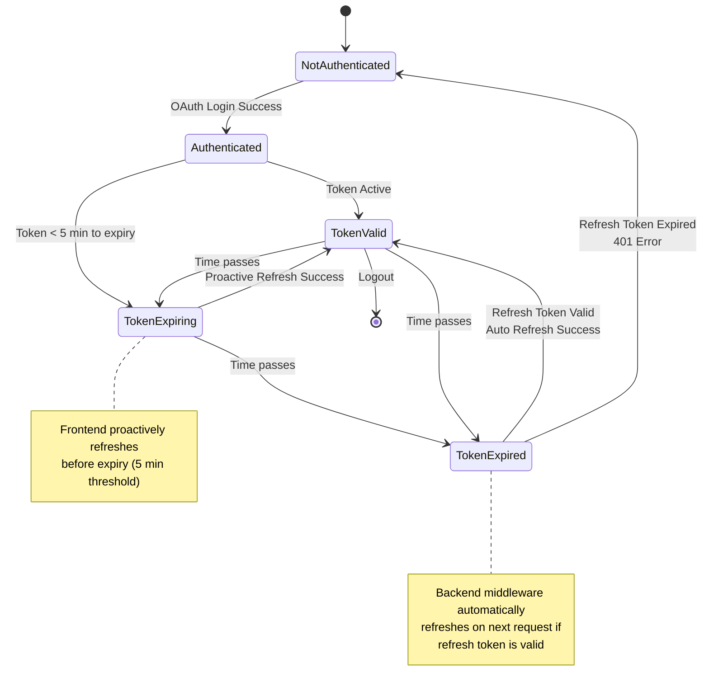

## Token Lifecycle Timeline

```mermaid
gantt
    title Token Lifecycle Example (15 min access token, 30 day refresh token)
    dateFormat X
    axisFormat %s
    
    section Access Token
    Token Valid (0-10 min)           :active, token1, 0, 600
    Near Expiry (10-15 min)         :crit, token2, 600, 900
    Expired (15+ min)               :done, token3, 900, 1800
    
    section Refresh Token
    Refresh Token Valid (0-30 days) :active, refresh1, 0, 2592000
    Refresh Token Expired (30+ days):done, refresh2, 2592000, 2593000
    
    section Actions
    Proactive Refresh (at 10 min)   :milestone, m1, 600, 0
    Auto Refresh (at 15 min)        :milestone, m2, 900, 0
    User Must Login (at 30 days)    :milestone, m3, 2592000, 0
```

## Key Points

### Frontend Responsibilities
- ✅ Proactive refresh when token expires in < 5 minutes
- ✅ Periodic checks every 1 minute
- ✅ Visibility API refresh when user returns to tab
- ✅ Track token expiry in localStorage
- ✅ Update expiry from all API responses

### Backend Responsibilities
- ✅ Reactive refresh when expired token detected
- ✅ Automatic refresh on all protected routes
- ✅ Proactive refresh when token expires in < 5 minutes
- ✅ Handle refresh token expiry gracefully
- ✅ Return token expiry info in `/api/auth/me` response

### Hybrid Approach Benefits
- **Resilient**: Frontend proactive + Backend reactive = No missed refreshes
- **Seamless**: User never sees 401 errors (unless refresh token expired)
- **Efficient**: Only refreshes when needed (5 min threshold)
- **Secure**: Refresh tokens never exposed to frontend (HTTP-only cookies)

## Error Handling

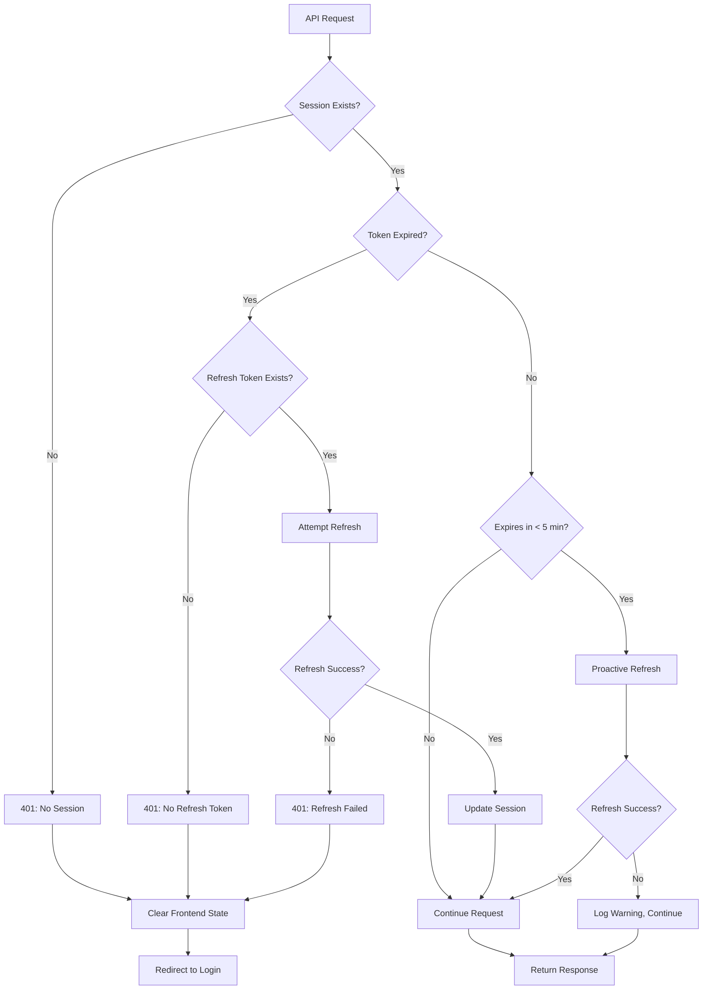

## Summary

The system handles all refresh token scenarios automatically:

1. ✅ **User returns next day** → Auto-refresh if refresh token valid
2. ✅ **Token near expiry** → Proactive refresh before expiry
3. ✅ **Token expired during request** → Reactive refresh by middleware
4. ✅ **Refresh token expired** → User must login (expected behavior)
5. ✅ **User returns to tab** → Check and refresh if needed
6. ✅ **No refresh token** → User must login (edge case)

The hybrid approach ensures users stay logged in as long as their refresh token is valid, with seamless token renewal happening automatically in the background.

