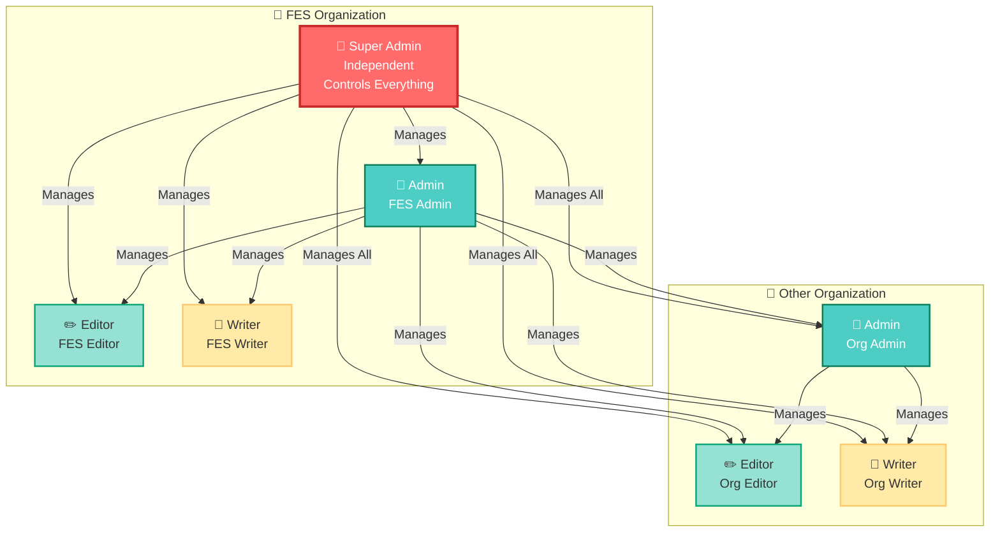
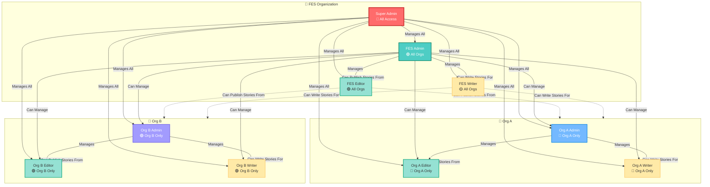

# Role-Based Access Control System - FES Stories Platform

## Overview

The FES Stories platform implements a hierarchical role-based access control (RBAC) system with 4 distinct roles. The permissions differ based on whether the user belongs to the **FES organization** or to **other organizations**.

---

## Role Hierarchy Diagram



---

## Detailed Permission Matrix

```mermaid
graph LR
    subgraph Roles["👥 Roles"]
        SA1[Super Admin]
        FA1[FES Admin]
        FE1[FES Editor]
        FW1[FES Writer]
        OA1[Org Admin]
        OE1[Org Editor]
        OW1[Org Writer]
    end

    subgraph Permissions["🔐 Permissions"]
        P1["👤 Manage Users"]
        P2["📁 Manage Categories"]
        P3["📖 View Stories"]
        P4["✍️ Write Stories"]
        P5["✅ Publish/Review Stories"]
        P6["🗑️ Delete Stories"]
        P7["📊 View Activity"]
    end

    SA1 -->|"All Permissions<br/>All Organizations"| P1
    SA1 -->|"All Permissions<br/>All Organizations"| P2
    SA1 -->|"All Permissions<br/>All Organizations"| P3
    SA1 -->|"All Permissions<br/>All Organizations"| P4
    SA1 -->|"All Permissions<br/>All Organizations"| P5
    SA1 -->|"All Permissions<br/>All Organizations"| P6
    SA1 -->|"All Permissions<br/>All Organizations"| P7

    FA1 -->|"All Orgs<br/>Users: All<br/>Categories: All"| P1
    FA1 -->|"All Orgs<br/>Categories: All"| P2
    FA1 -->|"All Orgs"| P3
    FA1 -->|"All Orgs"| P4
    FA1 -->|"All Orgs"| P5
    FA1 -.->|"No"| P6
    FA1 -->|"All"| P7

    FE1 -->|"No"| P1
    FE1 -->|"No"| P2
    FE1 -->|"All Orgs<br/>All Categories"| P3
    FE1 -->|"All Orgs<br/>All Categories"| P4
    FE1 -->|"All Orgs<br/>All Categories"| P5
    FE1 -.->|"No"| P6
    FE1 -.->|"No"| P7

    FW1 -->|"No"| P1
    FW1 -->|"No"| P2
    FW1 -->|"Own Stories Only"| P3
    FW1 -->|"All Orgs<br/>All Categories"| P4
    FW1 -.->|"No<br/>Submit for Review"| P5
    FW1 -.->|"No"| P6
    FW1 -.->|"No"| P7

    OA1 -->|"Own Org Only<br/>Editors & Writers"| P1
    OA1 -->|"Own Org Categories<br/>Can Create"| P2
    OA1 -->|"Own Org"| P3
    OA1 -->|"Own Org"| P4
    OA1 -->|"Own Org"| P5
    OA1 -.->|"No"| P6
    OA1 -.->|"Limited"| P7

    OE1 -->|"No"| P1
    OE1 -->|"No"| P2
    OE1 -->|"Own Org<br/>Own Categories"| P3
    OE1 -->|"Own Org<br/>Own Categories"| P4
    OE1 -->|"Own Org<br/>Own Categories"| P5
    OE1 -.->|"No"| P6
    OE1 -.->|"No"| P7

    OW1 -->|"No"| P1
    OW1 -->|"No"| P2
    OW1 -->|"Own Stories Only"| P3
    OW1 -->|"Own Org<br/>Own Categories"| P4
    OW1 -.->|"No<br/>Submit for Review"| P5
    OW1 -.->|"No"| P6
    OW1 -.->|"No"| P7

    style SA1 fill:#ff6b6b,stroke:#c92a2a,stroke-width:3px,color:#fff
    style FA1 fill:#4ecdc4,stroke:#087f5b,stroke-width:2px,color:#fff
    style OA1 fill:#4ecdc4,stroke:#087f5b,stroke-width:2px,color:#fff
    style FE1 fill:#95e1d3,stroke:#0ca678,stroke-width:2px
    style OE1 fill:#95e1d3,stroke:#0ca678,stroke-width:2px
    style FW1 fill:#ffeaa7,stroke:#fdcb6e,stroke-width:2px
    style OW1 fill:#ffeaa7,stroke:#fdcb6e,stroke-width:2px
```



---

## Role Capabilities Comparison Table

| Capability | Super Admin | FES Admin | FES Editor | FES Writer | Org Admin | Org Editor | Org Writer |
|------------|-------------|-----------|------------|------------|-----------|------------|------------|
| **Manage FES Users** | ✅ Yes (Including FES Admin) | ✅ Yes (Editors & Writers only) | ❌ No | ❌ No | ❌ No | ❌ No | ❌ No |
| **Manage Other Org Users** | ✅ Yes | ✅ Yes | ❌ No | ❌ No | ❌ No | ❌ No | ❌ No |
| **Manage Own Org Users** | ✅ Yes | ✅ Yes | ❌ No | ❌ No | ✅ Yes (Editors & Writers) | ❌ No | ❌ No |
| **Manage All Categories** | ✅ Yes | ✅ Yes | ❌ No | ❌ No | ❌ No | ❌ No | ❌ No |
| **Create Categories for Own Org** | ✅ Yes | ✅ Yes | ❌ No | ❌ No | ✅ Yes | ❌ No | ❌ No |
| **View All Stories** | ✅ Yes | ✅ Yes | ✅ Yes | ❌ No (Own Only) | ✅ Yes (Own Org) | ✅ Yes (Own Org) | ❌ No (Own Only) |
| **Write Stories - All Orgs** | ✅ Yes | ✅ Yes | ✅ Yes | ✅ Yes | ❌ No | ❌ No | ❌ No |
| **Write Stories - Own Org** | ✅ Yes | ✅ Yes | ✅ Yes | ✅ Yes | ✅ Yes | ✅ Yes | ✅ Yes |
| **Write Stories - All Categories** | ✅ Yes | ✅ Yes | ✅ Yes | ✅ Yes | ❌ No | ❌ No | ❌ No |
| **Write Stories - Own Categories** | ✅ Yes | ✅ Yes | ✅ Yes | ✅ Yes | ✅ Yes | ✅ Yes | ✅ Yes |
| **Publish/Review - All Orgs** | ✅ Yes | ✅ Yes | ✅ Yes | ❌ No (Submit Only) | ❌ No | ❌ No | ❌ No (Submit Only) |
| **Publish/Review - Own Org** | ✅ Yes | ✅ Yes | ✅ Yes | ❌ No (Submit Only) | ✅ Yes | ✅ Yes | ❌ No (Submit Only) |
| **Delete Stories** | ✅ Yes | ❌ No | ❌ No | ❌ No | ❌ No | ❌ No | ❌ No |
| **View Activity Logs** | ✅ Yes | ✅ Yes | ❌ No | ❌ No | ⚠️ Limited | ❌ No | ❌ No |

---

## Detailed Role Descriptions

### 👑 Super Admin
**Organization:** FES (Independent - No organization assignment required)

**Capabilities:**
- ✅ Full system control - manages everything across all organizations
- ✅ Can create/manage users of **all roles** in all organizations (including FES Admin, FES Editor, FES Writer)
- ✅ **Can manage FES Admin** - This is the key difference from FES Admin
- ✅ Can create/manage categories for all organizations
- ✅ Can view, write, publish, review, and delete stories from all organizations
- ✅ Can manage all organizations
- ✅ Full access to activity logs and system settings

**Use Case:** Platform administrators who need complete system oversight and control.

**Key Distinction:** Super Admin is the only role that can create, edit, or manage FES Admin users.

---

### 👔 FES Admin
**Organization:** FES

**Capabilities:**
- ✅ Can manage users (Editors & Writers) in **all organizations** including FES
- ❌ **Cannot manage Super Admin** - This is the key difference from Super Admin
- ✅ Can create/manage categories **across all organizations**
- ✅ Can view, write, publish, and review stories from **all organizations**
- ✅ Can write stories for **any organization** in **any category**
- ❌ Cannot delete stories
- ✅ Full access to activity logs

**Use Case:** FES organization administrators who manage the platform-wide content and users but don't need the absolute control of Super Admin.

**Key Distinction:** FES Admin has extensive permissions but cannot create, edit, or manage Super Admin users. Only Super Admin can manage other Super Admin users.

---

### ✏️ FES Editor
**Organization:** FES

**Capabilities:**
- ❌ Cannot manage users
- ❌ Cannot manage categories
- ✅ Can view stories from **all organizations**
- ✅ Can write stories for **any organization** in **any category**
- ✅ Can publish and review stories from **all organizations**
- ❌ Cannot delete stories
- ❌ No access to activity logs

**Use Case:** FES content editors who review and publish stories across all organizations but don't need administrative privileges.

---

### 📝 FES Writer
**Organization:** FES

**Capabilities:**
- ❌ Cannot manage users
- ❌ Cannot manage categories
- ✅ Can view own stories only
- ✅ Can write stories for **any organization** in **any category**
- ✅ Can submit stories for review (cannot publish directly)
- ❌ Cannot publish/approve stories
- ❌ Cannot delete stories
- ❌ No access to activity logs

**Use Case:** FES content writers who create stories for any organization but need editorial approval.

---

### 👔 Organization Admin
**Organization:** Any organization (except FES)

**Capabilities:**
- ✅ Can manage users (Editors & Writers) in **own organization only**
- ✅ Can create/manage categories for **own organization**
- ✅ Can view stories from **own organization**
- ✅ Can write stories for **own organization** in **own categories**
- ✅ Can publish and review stories from **own organization**
- ❌ Cannot manage users from other organizations
- ❌ Cannot create categories for other organizations
- ❌ Cannot write/publish stories for other organizations
- ❌ Cannot delete stories
- ⚠️ Limited access to activity logs (own org only)

**Use Case:** Organization administrators who manage their organization's content and users independently.

---

### ✏️ Organization Editor
**Organization:** Any organization (except FES)

**Capabilities:**
- ❌ Cannot manage users
- ❌ Cannot create/manage categories (but can use categories created by their Admin or Super Admin)
- ✅ Can view stories from **own organization**
- ✅ Can write stories for **own organization** in **categories available to their org**
- ✅ Can publish and review stories from **own organization**
- ❌ Cannot write/publish stories for other organizations
- ❌ Cannot delete stories
- ❌ No access to activity logs

**Use Case:** Organization content editors who review and publish stories within their organization.

---

### 📝 Organization Writer
**Organization:** Any organization (except FES)

**Capabilities:**
- ❌ Cannot manage users
- ❌ Cannot manage categories
- ✅ Can view own stories only
- ✅ Can write stories for **own organization** in **categories available to their org**
- ✅ Can submit stories for review (cannot publish directly)
- ❌ Cannot publish/approve stories
- ❌ Cannot delete stories
- ❌ No access to activity logs

**Use Case:** Organization content writers who create stories within their organization but need editorial approval.

---

## Access Scope Summary

### 🌐 FES Organization Roles
| Role | User Management | Category Management | Story Access | Story Creation | Story Publishing |
|------|----------------|-------------------|--------------|----------------|------------------|
| Super Admin | All Orgs<br/>(Including FES Admin) | All Orgs | All Orgs | All Orgs | All Orgs |
| FES Admin | All Orgs<br/>(Cannot manage Super Admin) | All Orgs | All Orgs | All Orgs | All Orgs |
| FES Editor | None | None | All Orgs | All Orgs | All Orgs |
| FES Writer | None | None | Own Only | All Orgs | Submit Only |

### 🏢 Other Organization Roles
| Role | User Management | Category Management | Story Access | Story Creation | Story Publishing |
|------|----------------|-------------------|--------------|----------------|------------------|
| Org Admin | Own Org Only | Own Org Only | Own Org | Own Org | Own Org |
| Org Editor | None | None (Use Only) | Own Org | Own Org | Own Org |
| Org Writer | None | None | Own Only | Own Org | Submit Only |

---

## Key Differences: FES vs Other Organizations

| Aspect | FES Organization | Other Organizations |
|--------|------------------|---------------------|
| **User Management** | Super Admin can manage **all users including FES Admin**<br/>FES Admin can manage users in **all organizations** (but not Super Admin) | Org Admin can manage users in **own organization only** |
| **Category Management** | FES Admin can create/manage categories for **all organizations** | Org Admin can create/manage categories for **own organization only** |
| **Story Access** | FES Editor can view/publish stories from **all organizations** | Org Editor can view/publish stories from **own organization only** |
| **Story Creation** | FES Writer can write stories for **any organization** | Org Writer can write stories for **own organization only** |
| **Independence** | Controls platform-wide operations | Operates independently within own scope |

---

## Practical Examples with Organizations

### Scenario: Organizations in the System
- **FES** (Foundation for Ecological Security)
- **Org A** (Example: Local NGO in Maharashtra)
- **Org B** (Example: Community Organization in Karnataka)

---

### Example 1: Category Management

**Scenario:** Creating story categories

| User | Role | Can Create Categories For | Example |
|------|------|---------------------------|---------|
| Super Admin | Super Admin | All organizations (FES, Org A, Org B) | Creates "Water Conservation" category → Available to all |
| FES Admin | FES Admin | All organizations (FES, Org A, Org B) | Creates "Forest Rights" category → Available to all |
| Org A Admin | Org Admin | Org A only | Creates "Maharashtra Agriculture" category → Available to Org A only |
| Org B Admin | Org Admin | Org B only | Creates "Karnataka Education" category → Available to Org B only |
| Org A Editor | Org Editor | ❌ Cannot create | Can only use categories created by Org A Admin or Super Admin |
| Org A Writer | Org Writer | ❌ Cannot create | Can only use categories created by Org A Admin or Super Admin |

**Result:**
- Org A Editor can write stories in:
  - "Water Conservation" (created by Super Admin)
  - "Forest Rights" (created by FES Admin)
  - "Maharashtra Agriculture" (created by Org A Admin)
  - ❌ NOT "Karnataka Education" (created by Org B Admin)

---

### Example 2: User Management

**Scenario:** Managing users across organizations

| User | Role | Can Manage Users In | Example |
|------|------|---------------------|---------|
| Super Admin | Super Admin | All organizations | Can create/edit/delete users in FES (including FES Admin), Org A, and Org B. **Only role that can manage FES Admin.** |
| FES Admin | FES Admin | All organizations | Can create/edit Org A Editor, Org B Writer, FES Editor, FES Writer in all organizations. **Cannot manage Super Admin.** |
| Org A Admin | Org Admin | Org A only | Can create/edit Org A Editor and Org A Writer |
| Org A Admin | Org Admin | ❌ Cannot manage | Cannot create/edit Org B users or FES users |
| Org B Admin | Org Admin | Org B only | Can create/edit Org B Editor and Org B Writer |

**Example Workflow:**
1. Super Admin creates Org A Admin user
2. Org A Admin creates Org A Editor and Org A Writer users
3. FES Admin can also create Org A Editor users (if needed)
4. Org A Admin cannot create Org B users or FES users

---

### Example 3: Story Writing and Publishing

**Scenario:** Writers creating stories and Editors publishing them

#### FES Writer Example:
- **FES Writer** can write stories and assign them to:
  - ✅ FES organization
  - ✅ Org A organization
  - ✅ Org B organization
- **FES Writer** can use categories from:
  - ✅ All categories (created by Super Admin, FES Admin, or any Org Admin)
- **FES Writer** submits story → Goes to pending review
- **FES Editor** can publish stories from:
  - ✅ FES organization
  - ✅ Org A organization
  - ✅ Org B organization

#### Org A Writer Example:
- **Org A Writer** can write stories and assign them to:
  - ✅ Org A organization only
  - ❌ Cannot assign to Org B or FES
- **Org A Writer** can use categories:
  - ✅ "Water Conservation" (created by Super Admin)
  - ✅ "Forest Rights" (created by FES Admin)
  - ✅ "Maharashtra Agriculture" (created by Org A Admin)
  - ❌ NOT "Karnataka Education" (created by Org B Admin)
- **Org A Writer** submits story → Goes to pending review
- **Org A Editor** can publish stories from:
  - ✅ Org A organization only
  - ❌ Cannot publish Org B stories

#### Org B Writer Example:
- **Org B Writer** can write stories and assign them to:
  - ✅ Org B organization only
- **Org B Writer** can use categories:
  - ✅ "Water Conservation" (created by Super Admin)
  - ✅ "Forest Rights" (created by FES Admin)
  - ✅ "Karnataka Education" (created by Org B Admin)
  - ❌ NOT "Maharashtra Agriculture" (created by Org A Admin)

---

### Example 4: Cross-Organization Story Management

**Scenario:** Story visibility and management

| User | Role | Can View Stories From | Can Publish Stories From |
|------|------|----------------------|-------------------------|
| Super Admin | Super Admin | All (FES, Org A, Org B) | All (FES, Org A, Org B) |
| FES Admin | FES Admin | All (FES, Org A, Org B) | All (FES, Org A, Org B) |
| FES Editor | FES Editor | All (FES, Org A, Org B) | All (FES, Org A, Org B) |
| FES Writer | FES Writer | Own stories only | ❌ Submit only (no publishing) |
| Org A Admin | Org Admin | Org A only | Org A only |
| Org A Editor | Org Editor | Org A only | Org A only |
| Org A Writer | Org Writer | Own stories only | ❌ Submit only (no publishing) |
| Org B Admin | Org Admin | Org B only | Org B only |
| Org B Editor | Org Editor | Org B only | Org B only |
| Org B Writer | Org Writer | Own stories only | ❌ Submit only (no publishing) |

**Real-World Example:**
1. **Org A Writer** writes a story about "Water Conservation in Maharashtra"
   - Story is assigned to Org A
   - Uses "Water Conservation" category
   - Status: Pending Review
2. **Org A Editor** can see and publish this story
3. **FES Editor** can also see and publish this story (cross-org access)
4. **Org B Editor** cannot see this story (different organization)

---

### Example 5: Category Assignment Workflow

**Scenario:** How categories become available to organizations

```
Super Admin creates "Global Category" 
    ↓
    Available to: FES, Org A, Org B

FES Admin creates "FES Category"
    ↓
    Available to: FES, Org A, Org B

Org A Admin creates "Org A Specific Category"
    ↓
    Available to: Org A only

Org B Admin creates "Org B Specific Category"
    ↓
    Available to: Org B only
```

**Result for Org A:**
- ✅ Can use "Global Category" (from Super Admin)
- ✅ Can use "FES Category" (from FES Admin)
- ✅ Can use "Org A Specific Category" (from Org A Admin)
- ❌ Cannot use "Org B Specific Category"

**Result for Org B:**
- ✅ Can use "Global Category" (from Super Admin)
- ✅ Can use "FES Category" (from FES Admin)
- ✅ Can use "Org B Specific Category" (from Org B Admin)
- ❌ Cannot use "Org A Specific Category"

---

### Example 6: Complete Workflow - Story Creation to Publication

#### Workflow 1: Org A Writer → Org A Editor

1. **Org A Writer** creates story:
   - Title: "Sustainable Farming in Maharashtra"
   - Organization: Org A
   - Category: "Maharashtra Agriculture" (created by Org A Admin)
   - Status: **Draft** → **Submitted for Review**

2. **Org A Editor** sees pending story:
   - Reviews story content
   - Can edit if needed
   - Approves and publishes
   - Status: **Published**

3. **Published Story Visibility:**
   - ✅ Visible to Org A Editor, Org A Admin
   - ✅ Visible to FES Editor, FES Admin, Super Admin (cross-org access)
   - ❌ Not visible to Org B Editor (different organization)
   - ✅ Visible to public (if story is public)

#### Workflow 2: FES Writer → FES Editor → Cross-Org Publishing

1. **FES Writer** creates story:
   - Title: "Community Forest Management"
   - Organization: **Org B** (FES Writer can choose any org)
   - Category: "Forest Rights" (created by FES Admin)
   - Status: **Draft** → **Submitted for Review**

2. **FES Editor** sees pending story:
   - Story is from Org B organization
   - Reviews and approves
   - Status: **Published**

3. **Published Story Visibility:**
   - ✅ Visible to Org B Editor, Org B Admin (story is in their org)
   - ✅ Visible to FES Editor, FES Admin, Super Admin
   - ❌ Not visible to Org A Editor (different organization)

---

## Visual Comparison: FES vs Org A vs Org B



**Legend:**
- 🔴 Red = Super Admin (highest authority)
- 🟢 Teal = FES Admin (cross-organization access)
- 🔵 Blue = Org A roles (Org A scope only)
- 🟣 Purple = Org B roles (Org B scope only)
- Solid lines = Management relationships
- Dashed lines = Story access/permissions

---

## Quick Reference: Common Scenarios

### Scenario: Can Org A Writer write stories for Org B?
**Answer:** ❌ No. Org A Writer can only write stories for Org A organization.

### Scenario: Can FES Writer write stories for Org A?
**Answer:** ✅ Yes. FES Writer can write stories for any organization (FES, Org A, Org B).

### Scenario: Can Org A Editor publish stories from Org B?
**Answer:** ❌ No. Org A Editor can only publish stories from Org A organization.

### Scenario: Can FES Editor publish stories from Org A?
**Answer:** ✅ Yes. FES Editor can publish stories from any organization.

### Scenario: Can Org A Admin create a category for Org B?
**Answer:** ❌ No. Org A Admin can only create categories for Org A.

### Scenario: Can FES Admin create a category that Org A can use?
**Answer:** ✅ Yes. FES Admin creates categories are available to all organizations.

### Scenario: Can Org A Writer use a category created by Org B Admin?
**Answer:** ❌ No. Org A Writer can only use categories created by Super Admin, FES Admin, or Org A Admin.

### Scenario: Can Org A Admin manage Org B users?
**Answer:** ❌ No. Org A Admin can only manage users (Editors & Writers) in Org A.

### Scenario: Can FES Admin manage Org A users?
**Answer:** ✅ Yes. FES Admin can manage users in all organizations including Org A (but cannot manage Super Admin).

### Scenario: Can Super Admin manage FES Admin?
**Answer:** ✅ Yes. Super Admin can create, edit, and manage FES Admin users. This is a key distinction - Super Admin has higher authority than FES Admin.

### Scenario: Can FES Admin manage Super Admin?
**Answer:** ❌ No. FES Admin cannot manage Super Admin users. Only Super Admin can manage other Super Admin users.

### Scenario: Can Org A Writer use "Karnataka Education" category (created by Org B Admin)?
**Answer:** ❌ No. Org A Writer cannot use categories created by other organizations. They can only use categories created by Super Admin, FES Admin, or Org A Admin.

### Scenario: Can Super Admin create an Org B Admin user?
**Answer:** ✅ Yes. Super Admin can create users with any role in any organization.

### Scenario: Can Org A Admin create an Org B Writer user?
**Answer:** ❌ No. Org A Admin can only create users (Editors & Writers) within Org A.

---

## Notes

- ⚠️ **Submit for Review:** Writers (both FES and Org) can only submit stories for review. They cannot directly publish stories.
- ⚠️ **Categories:** Organization Editors and Writers can only use categories that are:
  - Created by their Organization Admin, OR
  - Created by Super Admin or FES Admin (available to all organizations)
- ⚠️ **Story Deletion:** Only Super Admin can delete stories from the system.
- ⚠️ **User Role Assignment:** 
  - **Super Admin** can assign any role to any organization (including FES Admin role). Only Super Admin can create/manage FES Admin users.
  - **FES Admin** can assign any role to any organization (except Super Admin role). FES Admin cannot create/manage Super Admin users.
  - **Organization Admins** can only assign Editor or Writer roles within their organization.

---

**Document Version:** 1.0  
**Last Updated:** December 2025  
**Prepared for:** FES Stories Platform - Client Approval

