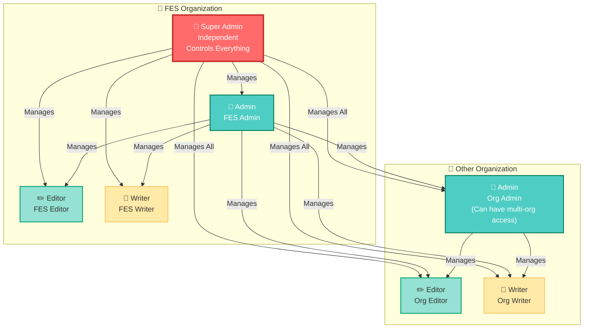

# Role-Based Access Control System - FES Stories Platform

## Overview

The FES Stories platform implements a hierarchical role-based access control (RBAC) system with 4 distinct roles. The permissions differ based on whether the user belongs to the **FES organization** or to **other organizations**.

---

## Role Hierarchy Diagram



---

## Role Capabilities Comparison Table

| Capability | Super Admin | FES Admin | FES Editor | FES Writer | Org Admin | Org Editor | Org Writer |
|------------|-------------|-----------|------------|------------|-----------|------------|------------|
| **Manage FES Users** | ✅ Yes (Including FES Admin) | ✅ Yes (Editors & Writers only) | ❌ No | ❌ No | ❌ No | ❌ No | ❌ No |
| **Manage Other Org Users** | ✅ Yes | ✅ Yes | ❌ No | ❌ No | ❌ No | ❌ No | ❌ No |
| **Manage Own Org Users** | ✅ Yes | ✅ Yes | ❌ No | ❌ No | ✅ Yes (Editors & Writers) | ❌ No | ❌ No |
| **Manage All Categories** | ✅ Yes | ✅ Yes | ❌ No | ❌ No | ❌ No | ❌ No | ❌ No |
| **Create Categories for Own Org** | ✅ Yes | ✅ Yes | ❌ No | ❌ No | ✅ Yes | ❌ No | ❌ No |
| **View All Stories** | ✅ Yes | ✅ Yes | ✅ Yes | ❌ No (Own Only) | ✅ Yes (Own Org) | ✅ Yes (Own Org) | ❌ No (Own Only) |
| **Write Stories - All Orgs** | ✅ Yes | ✅ Yes | ✅ Yes | ✅ Yes | ❌ No | ❌ No | ❌ No |
| **Write Stories - Own Org** | ✅ Yes | ✅ Yes | ✅ Yes | ✅ Yes | ✅ Yes | ✅ Yes | ✅ Yes |
| **Write Stories - All Categories** | ✅ Yes | ✅ Yes | ✅ Yes | ✅ Yes | ❌ No | ❌ No | ❌ No |
| **Write Stories - Own Categories** | ✅ Yes | ✅ Yes | ✅ Yes | ✅ Yes | ✅ Yes | ✅ Yes | ✅ Yes |
| **Publish/Review - All Orgs** | ✅ Yes | ✅ Yes | ✅ Yes | ❌ No (Submit Only) | ❌ No | ❌ No | ❌ No (Submit Only) |
| **Publish/Review - Own Org** | ✅ Yes | ✅ Yes | ✅ Yes | ❌ No (Submit Only) | ✅ Yes | ✅ Yes | ❌ No (Submit Only) |
| **Delete Stories** | ✅ Yes (All Orgs) | ✅ Yes (All Orgs) | ❌ No | ❌ No | ✅ Yes (Assigned Org(s) Only) | ❌ No | ❌ No |
| **View Activity Logs** | ✅ Yes | ✅ Yes | ✅ Yes | ✅ Yes | ✅ Yes | ✅ Yes | ✅ Yes |

---

## Detailed Role Descriptions

### 👑 Super Admin
**Organization:** FES (Independent - No organization assignment required)

**Capabilities:**
- ✅ Full system control - manages everything across all organizations
- ✅ Can create/manage users of **all roles** in all organizations (including FES Admin, FES Editor, FES Writer)
- ✅ **Can manage FES Admin** - This is the key difference from FES Admin
- ✅ Can create/manage categories for all organizations
- ✅ Can view, write, publish, review, and delete stories from all organizations
- ✅ Can manage all organizations
- ✅ Full access to activity logs and system settings

**Use Case:** Platform administrators who need complete system oversight and control.

**Key Distinction:** Super Admin is the only role that can create, edit, or manage FES Admin users.

---

### 👔 FES Admin
**Organization:** FES

**Capabilities:**
- ✅ Can manage users (Editors & Writers) in **all organizations** including FES
- ❌ **Cannot manage Super Admin** - This is the key difference from Super Admin
- ✅ Can create/manage categories **across all organizations**
- ✅ Can view, write, publish, and review stories from **all organizations**
- ✅ Can write stories for **any organization** in **any category**
- ✅ Can delete stories from **all organizations**
- ✅ Full access to activity logs

**Use Case:** FES organization administrators who manage the platform-wide content and users but don't need the absolute control of Super Admin.

**Key Distinction:** FES Admin has extensive permissions but cannot create, edit, or manage Super Admin users. Only Super Admin can manage other Super Admin users.

---

### ✏️ FES Editor
**Organization:** FES

**Capabilities:**
- ❌ Cannot manage users
- ❌ Cannot manage categories
- ✅ Can view stories from **all organizations**
- ✅ Can write stories for **any organization** in **any category**
- ✅ Can publish and review stories from **all organizations**
- ❌ Cannot delete stories
- ✅ Can view activity logs

**Use Case:** FES content editors who review and publish stories across all organizations but don't need administrative privileges.

---

### 📝 FES Writer
**Organization:** FES

**Capabilities:**
- ❌ Cannot manage users
- ❌ Cannot manage categories
- ✅ Can view own stories only
- ✅ Can write stories for **any organization** in **any category**
- ✅ Can submit stories for review (cannot publish directly)
- ❌ Cannot publish/approve stories
- ❌ Cannot delete stories
- ✅ Can view activity logs

**Use Case:** FES content writers who create stories for any organization but need editorial approval.

---

### 👔 Organization Admin
**Organization:** Any organization (except FES). **Can have access to multiple organizations if granted by Super Admin or FES Admin.**

**Capabilities:**
- ✅ Can manage users (Editors & Writers) in **assigned organization(s) only**
- ✅ Can create/manage categories for **assigned organization(s)**
- ✅ Can view stories from **assigned organization(s)**
- ✅ Can write stories for **assigned organization(s)** in **available categories**
- ✅ Can publish and review stories from **assigned organization(s)**
- ✅ Can delete stories from **assigned organization(s)**
- ❌ Cannot manage users from organizations they don't have access to
- ❌ Cannot create categories for organizations they don't have access to
- ❌ Cannot write/publish stories for organizations they don't have access to
- ✅ Can view activity logs

**Use Case:** Organization administrators who manage their organization's content and users. Can be granted access to multiple organizations by Super Admin or FES Admin for cross-organization management.

---

### ✏️ Organization Editor
**Organization:** Any organization (except FES)

**Capabilities:**
- ❌ Cannot manage users
- ❌ Cannot create/manage categories (but can use categories created by their Admin or Super Admin)
- ✅ Can view stories from **own organization**
- ✅ Can write stories for **own organization** in **categories available to their org**
- ✅ Can publish and review stories from **own organization**
- ❌ Cannot write/publish stories for other organizations
- ❌ Cannot delete stories
- ✅ Can view activity logs

**Use Case:** Organization content editors who review and publish stories within their organization.

---

### 📝 Organization Writer
**Organization:** Any organization (except FES)

**Capabilities:**
- ❌ Cannot manage users
- ❌ Cannot manage categories
- ✅ Can view own stories only
- ✅ Can write stories for **own organization** in **categories available to their org**
- ✅ Can submit stories for review (cannot publish directly)
- ❌ Cannot publish/approve stories
- ❌ Cannot delete stories
- ✅ Can view activity logs

**Use Case:** Organization content writers who create stories within their organization but need editorial approval.

---

## Access Scope Summary

### 🌐 FES Organization Roles
| Role | User Management | Category Management | Story Access | Story Creation | Story Publishing |
|------|----------------|-------------------|--------------|----------------|------------------|
| Super Admin | All Orgs<br/>(Including FES Admin) | All Orgs | All Orgs | All Orgs | All Orgs |
| FES Admin | All Orgs<br/>(Cannot manage Super Admin) | All Orgs | All Orgs | All Orgs | All Orgs |
| FES Editor | None | None | All Orgs | All Orgs | All Orgs |
| FES Writer | None | None | Own Only | All Orgs | Submit Only |

### 🏢 Other Organization Roles
| Role | User Management | Category Management | Story Access | Story Creation | Story Publishing | Story Deletion |
|------|----------------|-------------------|--------------|----------------|------------------|----------------|
| Org Admin | Assigned Org(s) Only | Assigned Org(s) Only | Assigned Org(s) | Assigned Org(s) | Assigned Org(s) | Assigned Org(s) Only |
| Org Editor | None | None (Use Only) | Own Org | Own Org | Own Org | None |
| Org Writer | None | None | Own Only | Own Org | Submit Only | None |

---

## Key Differences: FES vs Other Organizations

| Aspect | FES Organization | Other Organizations |
|--------|------------------|---------------------|
| **User Management** | Super Admin can manage **all users including FES Admin**<br/>FES Admin can manage users in **all organizations** (but not Super Admin) | Org Admin can manage users in **assigned organization(s)** (can have access to multiple orgs if granted by Super Admin or FES Admin) |
| **Category Management** | FES Admin can create/manage categories for **all organizations** | Org Admin can create/manage categories for **own organization only** |
| **Story Access** | FES Editor can view/publish stories from **all organizations** | Org Editor can view/publish stories from **own organization only** |
| **Story Creation** | FES Writer can write stories for **any organization** | Org Writer can write stories for **own organization only** |
| **Independence** | Controls platform-wide operations | Operates independently within own scope |

---

## Practical Examples with Organizations

### Scenario: Organizations in the System
- **FES** (Foundation for Ecological Security)
- **Org A** (Example: Local NGO in Maharashtra)
- **Org B** (Example: Community Organization in Karnataka)

---

### Example 1: Category Management

**Scenario:** Creating story categories

| User | Role | Can Create Categories For | Example |
|------|------|---------------------------|---------|
| Super Admin | Super Admin | All organizations (FES, Org A, Org B) | Creates "Water Conservation" category → Available to all |
| FES Admin | FES Admin | All organizations (FES, Org A, Org B) | Creates "Forest Rights" category → Available to all |
| Org A Admin | Org Admin | Org A only | Creates "Maharashtra Agriculture" category → Available to Org A only |
| Org B Admin | Org Admin | Org B only | Creates "Karnataka Education" category → Available to Org B only |
| Org A Editor | Org Editor | ❌ Cannot create | Can only use categories created by Org A Admin or Super Admin |
| Org A Writer | Org Writer | ❌ Cannot create | Can only use categories created by Org A Admin or Super Admin |

**Result:**
- Org A Editor can write stories in:
  - "Water Conservation" (created by Super Admin)
  - "Forest Rights" (created by FES Admin)
  - "Maharashtra Agriculture" (created by Org A Admin)
  - ❌ NOT "Karnataka Education" (created by Org B Admin)

---

### Example 2: User Management

**Scenario:** Managing users across organizations

| User | Role | Can Manage Users In | Example |
|------|------|---------------------|---------|
| Super Admin | Super Admin | All organizations | Can create/edit/delete users in FES (including FES Admin), Org A, and Org B. **Only role that can manage FES Admin.** |
| FES Admin | FES Admin | All organizations | Can create/edit Org A Editor, Org B Writer, FES Editor, FES Writer in all organizations. **Cannot manage Super Admin.** |
| Org A Admin | Org Admin | Org A (or assigned orgs) | Can create/edit Org A Editor and Org A Writer. If granted access to Org B by Super Admin or FES Admin, can also manage Org B users. |
| Org A Admin | Org Admin | ❌ Cannot manage | Cannot create/edit users in organizations they don't have access to (unless granted by Super Admin or FES Admin) |
| Org B Admin | Org Admin | Org B (or assigned orgs) | Can create/edit Org B Editor and Org B Writer. If granted access to Org A by Super Admin or FES Admin, can also manage Org A users. |

**Example Workflow:**
1. Super Admin creates Org A Admin user (assigned to Org A)
2. Org A Admin creates Org A Editor and Org A Writer users
3. FES Admin can also create Org A Editor users (if needed)
4. Super Admin or FES Admin can grant Org A Admin access to Org B
5. Org A Admin (with multi-org access) can now manage Org B Editor and Org B Writer users
6. Org A Admin without multi-org access cannot create Org B users or FES users

---

### Example 2.5: Multi-Organization Access for Org Admins

**Scenario:** Super Admin or FES Admin granting Org Admin access to multiple organizations

| User | Role | Initial Access | After Grant | Can Now Manage |
|------|------|----------------|-------------|----------------|
| Org A Admin | Org Admin | Org A only | Org A + Org B | Users, categories, stories in both Org A and Org B |
| Org B Admin | Org Admin | Org B only | Org B + Org A | Users, categories, stories in both Org B and Org A |

**Example Workflow:**
1. **Super Admin** creates Org A Admin user (assigned to Org A only)
2. **Org A Admin** can manage users, categories, and stories in Org A
3. **Super Admin** grants Org A Admin access to Org B
4. **Org A Admin** can now:
   - ✅ Manage Org B Editor and Org B Writer users
   - ✅ Create categories for Org B
   - ✅ View, publish, and delete stories from Org B
   - ✅ Write stories for Org B
5. **FES Admin** can also grant multi-org access to Org Admins

**Use Case:** Useful when organizations collaborate closely or when an experienced admin needs to manage multiple related organizations.

---

### Example 3: Story Writing and Publishing

**Scenario:** Writers creating stories and Editors publishing them

#### FES Writer Example:
- **FES Writer** can write stories and assign them to:
  - ✅ FES organization
  - ✅ Org A organization
  - ✅ Org B organization
- **FES Writer** can use categories from:
  - ✅ All categories (created by Super Admin, FES Admin, or any Org Admin)
- **FES Writer** submits story → Goes to pending review
- **FES Editor** can publish stories from:
  - ✅ FES organization
  - ✅ Org A organization
  - ✅ Org B organization

#### Org A Writer Example:
- **Org A Writer** can write stories and assign them to:
  - ✅ Org A organization only
  - ❌ Cannot assign to Org B or FES
- **Org A Writer** can use categories:
  - ✅ "Water Conservation" (created by Super Admin)
  - ✅ "Forest Rights" (created by FES Admin)
  - ✅ "Maharashtra Agriculture" (created by Org A Admin)
  - ❌ NOT "Karnataka Education" (created by Org B Admin)
- **Org A Writer** submits story → Goes to pending review
- **Org A Editor** can publish stories from:
  - ✅ Org A organization only
  - ❌ Cannot publish Org B stories

#### Org B Writer Example:
- **Org B Writer** can write stories and assign them to:
  - ✅ Org B organization only
- **Org B Writer** can use categories:
  - ✅ "Water Conservation" (created by Super Admin)
  - ✅ "Forest Rights" (created by FES Admin)
  - ✅ "Karnataka Education" (created by Org B Admin)
  - ❌ NOT "Maharashtra Agriculture" (created by Org A Admin)

---

### Example 4: Cross-Organization Story Management

**Scenario:** Story visibility and management

| User | Role | Can View Stories From | Can Publish Stories From | Can Delete Stories From |
|------|------|----------------------|-------------------------|------------------------|
| Super Admin | Super Admin | All (FES, Org A, Org B) | All (FES, Org A, Org B) | All (FES, Org A, Org B) |
| FES Admin | FES Admin | All (FES, Org A, Org B) | All (FES, Org A, Org B) | All (FES, Org A, Org B) |
| FES Editor | FES Editor | All (FES, Org A, Org B) | All (FES, Org A, Org B) | ❌ No |
| FES Writer | FES Writer | Own stories only | ❌ Submit only (no publishing) | ❌ No |
| Org A Admin | Org Admin | Org A (or assigned orgs) | Org A (or assigned orgs) | Org A (or assigned orgs) |
| Org A Editor | Org Editor | Org A only | Org A only | ❌ No |
| Org A Writer | Org Writer | Own stories only | ❌ Submit only (no publishing) | ❌ No |
| Org B Admin | Org Admin | Org B (or assigned orgs) | Org B (or assigned orgs) | Org B (or assigned orgs) |
| Org B Editor | Org Editor | Org B only | Org B only | ❌ No |
| Org B Writer | Org Writer | Own stories only | ❌ Submit only (no publishing) | ❌ No |

**Real-World Example:**
1. **Org A Writer** writes a story about "Water Conservation in Maharashtra"
   - Story is assigned to Org A
   - Uses "Water Conservation" category
   - Status: Pending Review
2. **Org A Editor** can see and publish this story
3. **FES Editor** can also see and publish this story (cross-org access)
4. **Org B Editor** cannot see this story (different organization)
5. **FES Admin** can delete this story (can delete from all orgs)
6. **Org A Admin** can delete this story (can delete from own org)
7. **Org B Admin** cannot delete this story (different organization, unless granted access to Org A)

---

### Example 5: Category Assignment Workflow

**Scenario:** How categories become available to organizations

```
Super Admin creates "Global Category" 
    ↓
    Available to: FES, Org A, Org B

FES Admin creates "FES Category"
    ↓
    Available to: FES, Org A, Org B

Org A Admin creates "Org A Specific Category"
    ↓
    Available to: Org A only

Org B Admin creates "Org B Specific Category"
    ↓
    Available to: Org B only
```

**Result for Org A:**
- ✅ Can use "Global Category" (from Super Admin)
- ✅ Can use "FES Category" (from FES Admin)
- ✅ Can use "Org A Specific Category" (from Org A Admin)
- ❌ Cannot use "Org B Specific Category"

**Result for Org B:**
- ✅ Can use "Global Category" (from Super Admin)
- ✅ Can use "FES Category" (from FES Admin)
- ✅ Can use "Org B Specific Category" (from Org B Admin)
- ❌ Cannot use "Org A Specific Category"

---

### Example 6: Complete Workflow - Story Creation to Publication

#### Workflow 1: Org A Writer → Org A Editor

1. **Org A Writer** creates story:
   - Title: "Sustainable Farming in Maharashtra"
   - Organization: Org A
   - Category: "Maharashtra Agriculture" (created by Org A Admin)
   - Status: **Draft** → **Submitted for Review**

2. **Org A Editor** sees pending story:
   - Reviews story content
   - Can edit if needed
   - Approves and publishes
   - Status: **Published**

3. **Published Story Visibility:**
   - ✅ Visible to Org A Editor, Org A Admin
   - ✅ Visible to FES Editor, FES Admin, Super Admin (cross-org access)
   - ❌ Not visible to Org B Editor (different organization)
   - ✅ Visible to public (if story is public)

#### Workflow 2: FES Writer → FES Editor → Cross-Org Publishing

1. **FES Writer** creates story:
   - Title: "Community Forest Management"
   - Organization: **Org B** (FES Writer can choose any org)
   - Category: "Forest Rights" (created by FES Admin)
   - Status: **Draft** → **Submitted for Review**

2. **FES Editor** sees pending story:
   - Story is from Org B organization
   - Reviews and approves
   - Status: **Published**

3. **Published Story Visibility:**
   - ✅ Visible to Org B Editor, Org B Admin (story is in their org)
   - ✅ Visible to FES Editor, FES Admin, Super Admin
   - ❌ Not visible to Org A Editor (different organization, unless Org A Admin has multi-org access to Org B)
4. **Story Deletion:**
   - ✅ FES Admin can delete this story (can delete from all orgs)
   - ✅ Org B Admin can delete this story (can delete from own org)
   - ✅ Org A Admin can delete this story (if granted access to Org B)

---

## Visual Comparison: FES vs Org A vs Org B

```mermaid
graph TB
    subgraph FES["🏢 FES Organization"]
        SA[Super Admin<br/>🔴 All Access]
        FA[FES Admin<br/>🟢 All Orgs]
        FE[FES Editor<br/>🟢 All Orgs]
        FW[FES Writer<br/>🟡 All Orgs]
    end

    subgraph OrgA["🏢 Org A"]
        AA[Org A Admin<br/>🔵 Org A (or Multi-Org)]
        AE[Org A Editor<br/>🔵 Org A Only]
        AW[Org A Writer<br/>🔵 Org A Only]
    end

    subgraph OrgB["🏢 Org B"]
        BA[Org B Admin<br/>🟣 Org B (or Multi-Org)]
        BE[Org B Editor<br/>🟣 Org B Only]
        BW[Org B Writer<br/>🟣 Org B Only]
    end

    SA -->|"Manages All"| FA
    SA -->|"Manages All"| FE
    SA -->|"Manages All"| FW
    SA -->|"Manages All"| AA
    SA -->|"Manages All"| AE
    SA -->|"Manages All"| AW
    SA -->|"Manages All"| BA
    SA -->|"Manages All"| BE
    SA -->|"Manages All"| BW

    FA -->|"Manages"| FE
    FA -->|"Manages"| FW
    FA -->|"Can Manage"| AA
    FA -->|"Can Manage"| AE
    FA -->|"Can Manage"| AW
    FA -->|"Can Manage"| BA
    FA -->|"Can Manage"| BE
    FA -->|"Can Manage"| BW

    AA -->|"Manages"| AE
    AA -->|"Manages"| AW

    BA -->|"Manages"| BE
    BA -->|"Manages"| BW

    FE -.->|"Can Publish Stories From"| OrgA
    FE -.->|"Can Publish Stories From"| OrgB
    FE -.->|"Can Publish Stories From"| FES

    AE -.->|"Can Publish Stories From"| OrgA
    BE -.->|"Can Publish Stories From"| OrgB

    FW -.->|"Can Write Stories For"| OrgA
    FW -.->|"Can Write Stories For"| OrgB
    FW -.->|"Can Write Stories For"| FES

    AW -.->|"Can Write Stories For"| OrgA
    BW -.->|"Can Write Stories For"| OrgB

    style SA fill:#ff6b6b,stroke:#c92a2a,stroke-width:3px,color:#fff
    style FA fill:#4ecdc4,stroke:#087f5b,stroke-width:2px,color:#fff
    style AA fill:#74b9ff,stroke:#0984e3,stroke-width:2px,color:#fff
    style BA fill:#a29bfe,stroke:#6c5ce7,stroke-width:2px,color:#fff
    style FE fill:#95e1d3,stroke:#0ca678,stroke-width:2px
    style AE fill:#95e1d3,stroke:#0ca678,stroke-width:2px
    style BE fill:#95e1d3,stroke:#0ca678,stroke-width:2px
    style FW fill:#ffeaa7,stroke:#fdcb6e,stroke-width:2px
    style AW fill:#ffeaa7,stroke:#fdcb6e,stroke-width:2px
    style BW fill:#ffeaa7,stroke:#fdcb6e,stroke-width:2px
```

**Legend:**
- 🔴 Red = Super Admin (highest authority)
- 🟢 Teal = FES Admin (cross-organization access, can delete stories)
- 🔵 Blue = Org A roles (Org A scope, Admin can have multi-org access)
- 🟣 Purple = Org B roles (Org B scope, Admin can have multi-org access)
- Solid lines = Management relationships
- Dashed lines = Story access/permissions

---

## Quick Reference: Common Scenarios

### Scenario: Can Org A Writer write stories for Org B?
**Answer:** ❌ No. Org A Writer can only write stories for Org A organization.

### Scenario: Can FES Writer write stories for Org A?
**Answer:** ✅ Yes. FES Writer can write stories for any organization (FES, Org A, Org B).

### Scenario: Can Org A Editor publish stories from Org B?
**Answer:** ❌ No. Org A Editor can only publish stories from Org A organization.

### Scenario: Can FES Editor publish stories from Org A?
**Answer:** ✅ Yes. FES Editor can publish stories from any organization.

### Scenario: Can Org A Admin create a category for Org B?
**Answer:** ❌ No. Org A Admin can only create categories for Org A.

### Scenario: Can FES Admin create a category that Org A can use?
**Answer:** ✅ Yes. FES Admin creates categories are available to all organizations.

### Scenario: Can Org A Writer use a category created by Org B Admin?
**Answer:** ❌ No. Org A Writer can only use categories created by Super Admin, FES Admin, or Org A Admin.

### Scenario: Can Org A Admin manage Org B users?
**Answer:** ✅ Yes, if granted access to Org B by Super Admin or FES Admin. Otherwise, ❌ No - Org A Admin can only manage users (Editors & Writers) in their assigned organization(s).

### Scenario: Can FES Admin manage Org A users?
**Answer:** ✅ Yes. FES Admin can manage users in all organizations including Org A (but cannot manage Super Admin).

### Scenario: Can Super Admin manage FES Admin?
**Answer:** ✅ Yes. Super Admin can create, edit, and manage FES Admin users. This is a key distinction - Super Admin has higher authority than FES Admin.

### Scenario: Can FES Admin manage Super Admin?
**Answer:** ❌ No. FES Admin cannot manage Super Admin users. Only Super Admin can manage other Super Admin users.

### Scenario: Can Org A Writer use "Karnataka Education" category (created by Org B Admin)?
**Answer:** ❌ No. Org A Writer cannot use categories created by other organizations. They can only use categories created by Super Admin, FES Admin, or Org A Admin.

### Scenario: Can Super Admin create an Org B Admin user?
**Answer:** ✅ Yes. Super Admin can create users with any role in any organization.

### Scenario: Can Org A Admin create an Org B Writer user?
**Answer:** ✅ Yes, if Super Admin or FES Admin has granted Org A Admin access to Org B. Otherwise, ❌ No - Org A Admin can only create users (Editors & Writers) within their assigned organization(s).

---

## Notes

- ⚠️ **Submit for Review:** Writers (both FES and Org) can only submit stories for review. They cannot directly publish stories.
- ⚠️ **Categories:** Organization Editors and Writers can only use categories that are:
  - Created by their Organization Admin, OR
  - Created by Super Admin or FES Admin (available to all organizations)
- ⚠️ **Story Deletion:** 
  - **Super Admin** can delete stories from all organizations
  - **FES Admin** can delete stories from all organizations
  - **Org Admin** can delete stories from their assigned organization(s) only
  - **Editors and Writers** cannot delete stories
- ⚠️ **User Role Assignment:** 
  - **Super Admin** can assign any role to any organization (including FES Admin role). Only Super Admin can create/manage FES Admin users.
  - **FES Admin** can assign any role to any organization (except Super Admin role). FES Admin cannot create/manage Super Admin users.
  - **Organization Admins** can only assign Editor or Writer roles within their assigned organization(s). Super Admin or FES Admin can grant Org Admins access to multiple organizations.
- ⚠️ **Activity Logs:** All users can view activity logs to track system activities and changes.

---

**Document Version:** 2.0  
**Last Updated:** December 2025  
**Prepared for:** FES Stories Platform - Client Approval

## Version 2.0 Changes

- ✅ **FES Admin** can now delete stories from all organizations
- ✅ **Org Admin** can now delete stories from their assigned organization(s)
- ✅ **Activity Logs** are now accessible to all users
- ✅ **Org Admin** can have access to multiple organizations (if granted by Super Admin or FES Admin)
- ❌ Removed detailed permission matrix diagram for clarity

